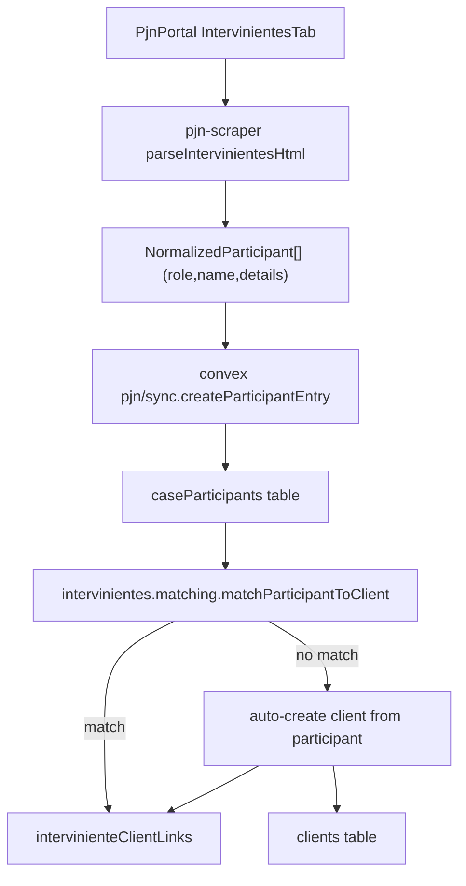

### Goals

- **Capture full participant data** from the PJN Intervinientes tab, including TOMO/FOLIO and I.E.J from nested detail rows and additional tables like `FISCALES`.
- **Populate identifiers** (DNI/CUIT/CUIL) in `caseParticipants` whenever available, via existing identifier parsing utilities.
- **Automatically create clients** (even when no identifier exists) for intervinientes that don’t match any existing client, and link them to the case.

### Scope

- **Scraper changes** in `[apps/pjn-scraper/src/lib/pjnCaseHistoryParsers.ts]` to enrich `NormalizedParticipant` entries from PJN HTML.
- **Convex backend changes** in:
  - `[apps/application/convex/pjn/sync.ts]` for participant creation from scraped data.
  - `[apps/application/convex/intervinientes/matching.ts]` for matching logic and auto-creation.
  - Optionally `[apps/application/convex/intervinientes/settings.ts]` to control auto-create behavior.
- **No UI changes required** initially; existing Intervinientes panel should reflect new links and auto-created clients.

### Data flow overview

### Step 1: Enhance Intervinientes scraping

- **1.1 Extend `parseIntervinientesHtml` to handle nested detail rows**
  - Keep existing logic that finds the main `PARTES` table by selectors like `#expediente:participantsTable`.
  - For each `tbody.rf-dt-b` (main participant body):
    - Continue creating a primary `NormalizedParticipant` for the main row (e.g. `IMPUTADO`, `PRESENTANTE`) using current role/name parsing.
    - Find the immediate sibling `tbody.rf-cst` that contains nested detail rows (`tr.rf-cst-r`).
    - For each nested row:
      - Extract role (e.g. `LETRADO DEFENSOR PARTICULAR`), name (e.g. `CESAR ANDRES LOPEZ`), TOMO/FOLIO cell, and I.E.J cell.
      - Build `details` as a pipe-separated string like `"Tomo: 124 Folio: 134 - Federal | 20345689312"` (skipping empties).
      - Push an additional `NormalizedParticipant` entry for each nested row with these values.
- **1.2 Parse `FISCALES` table as participants**
  - In the same function, after `PARTES`, locate the `FISCALES` table (`#expediente:fiscalesTable`).
  - For each row:
    - Role could be normalized to something like `FISCAL`.
    - Name from the `FISCAL` column.
    - I.E.J from the I.E.J column; optionally include context in `details` (e.g. `"FISCALIA FEDERAL DE ... | 20208810619"`).
    - Create `NormalizedParticipant` entries for fiscales.
- **1.3 Keep participants model unchanged**
  - Reuse existing `NormalizedParticipant { participantId, role, name, details? }` and hash generation.
  - Accept that some participants (e.g. imputados) will have no `details`, while nested defenders/fiscales will.

### Step 2: Ensure identifiers are parsed into `caseParticipants`

- **2.1 Reuse `extractIejpFromDetails` and `parseIejpValue`**
  - No changes needed to `[apps/application/convex/utils/identifierParser.ts]`; it already:
    - Extracts the last digit-containing segment from `details` as raw value.
    - Parses into `DocumentType` (DNI/CUIT/CUIL/PASSPORT/OTHER) and normalized number.
- **2.2 Confirm `createParticipantEntry` persists identifiers**
  - `createParticipantEntry` in `[apps/application/convex/pjn/sync.ts]` already:
    - Calls `extractIejpFromDetails(participant.details)`.
    - Stores raw value in `caseParticipants.iejp` and normalized number/type in `documentNumber` / `documentType`.
  - After Step 1, nested defender/fiscal participants will start populating these fields automatically.

### Step 3: Design rules for which participants should auto-create clients

- **3.1 Define role-based predicate**
  - Introduce a conceptual helper (used in matching) like `shouldAutoCreateClient(roleMapping, hasIdentifier)` that decides whether to auto-create:
    - Always allow auto-create for **party roles** (local roles where `isPartyRole(localRole) === true`), even when there is **no identifier**.
    - Additionally allow auto-create for **non-judicial roles with identifiers** (e.g. attorneys with IEJ/CUIT, other agents), so they can be represented as clients when relevant.
    - Optionally exclude purely judicial roles (e.g. judges/fiscales) if you don’t want them as clients; this can be tuned inside the helper using `isJudicialRole`.
- **3.2 (Optional) Make auto-create configurable**
  - Extend `[apps/application/convex/intervinientes/settings.ts]` with new flags, for example:
    - `autoCreateClientsForParties: boolean` (default true).
    - `autoCreateClientsForAttorneys: boolean` (default true).
    - `autoCreateClientsForJudicialRoles: boolean` (default false).
  - Use these flags inside the predicate so behavior can be toggled without code changes.

### Step 4: Implement automatic client creation in matching

- **4.1 Extend `matchParticipantToClient` flow** in `[apps/application/convex/intervinientes/matching.ts]`:
  - Keep the existing logic:
    - Try to find candidates by `documentNumber` and name.
    - Compute scores; if any candidate meets thresholds, create/update `intervinienteClientLinks` with `AUTO_HIGH_CONFIDENCE` or `AUTO_LOW_CONFIDENCE`.
  - After current logic determines there is **no viable candidate** (`NO_CANDIDATES` or `NO_MATCH`), add a branch:
    - If `shouldAutoCreateClient(roleMapping, Boolean(participant.documentNumber))` is true, call an internal helper/mutation to auto-create a client and link it.
    - Otherwise, return the existing status (`NO_MATCH`) without creating a client.
- **4.2 Create an internal auto-create helper** (conceptually inside `matching.ts` or as a dedicated internal mutation):
  - Inputs: `participantId`, `caseId`, plus the participant document fields if present.
  - Behavior:
    - Load the `caseParticipants` row.
    - **Infer `naturalezaJuridica`**:
      - Default to `"humana"` for roles that represent persons (parties, attorneys, fiscales).
      - Optionally treat some roles as `"juridica"` based on naming patterns or a future config.
    - **Split name into `apellido` and `nombre`** for `naturalezaJuridica === "humana"`:
      - Heuristic: last word(s) as `nombre`, leading tokens as `apellido`, or use a simple rule like `"APELLIDO(S) NOMBRE(S)"` → split at first space.
      - Use full `participant.name` as `displayName` fallback if parsing is ambiguous.
    - **Populate identifier fields**:
      - If `participant.documentNumber` and `documentType` are present, map them to `dni` or `cuit` as appropriate.
      - Otherwise, leave those fields empty; the client will exist **without** DNI/CUIT/CUIL, as required.
    - Insert into `clients` with `isActive: true` and a reasonable `displayName`.
    - Create an `intervinienteClientLinks` entry with high-confidence link type (e.g. `AUTO_HIGH_CONFIDENCE` or a consistently used type) and an explanatory `matchReason` like `"Cliente creado automáticamente para interviniente sin coincidencias"`.
    - If the local role is a party role (`isPartyRole`), ensure a `clientCases` relation exists for this case (reusing `ensureClientCaseRelation`).

### Step 5: Keep manual creation and review flows

- **5.1 Preserve manual `createClientFromInterviniente`**
  - Leave the existing mutation in `[apps/application/convex/intervinientes/queries.ts]` unchanged so users can still override or correct auto-created clients.
- **5.2 Allow rematching after client changes**
  - `rematchParticipantsForCase` already re-runs matching for all participants.
  - After adding auto-create, this should still work; existing links prevent duplicate auto-creation since `getExistingLink` returns a link and matching exits early.

### Step 6: Testing strategy

- **6.1 Unit/logic tests (if you have a test harness)**
  - For `parseIntervinientesHtml`, feed it the saved HTML from `[apps/pjn-scraper/storage/debug/2026-01-15_14-00-05_opx5/FRE-003852_2020_5_04_intervinientes.html]` and assert:
    - Primary participants (IMPUTADOS) are present with correct `role` and `name`.
    - Nested defenders and fiscales appear as additional participants with `details` containing both TOMO/FOLIO and I.E.J.
  - For matching, simulate participants with and without identifiers and assert:
    - Auto-link when an existing client matches by identifier.
    - Auto-create a new client and link when there is no candidate and the role is allowed.
- **6.2 End-to-end testing**
  - Trigger a new PJN sync for the known expediente (`FRE-003852/2020/5`).
  - Verify in the Intervinientes panel:
    - Participants now show IEJ for roles where the HTML has it.
    - For imputados and other configured roles with no existing client, a new client has been created and linked.
    - Manually created clients from the UI still work as expected.