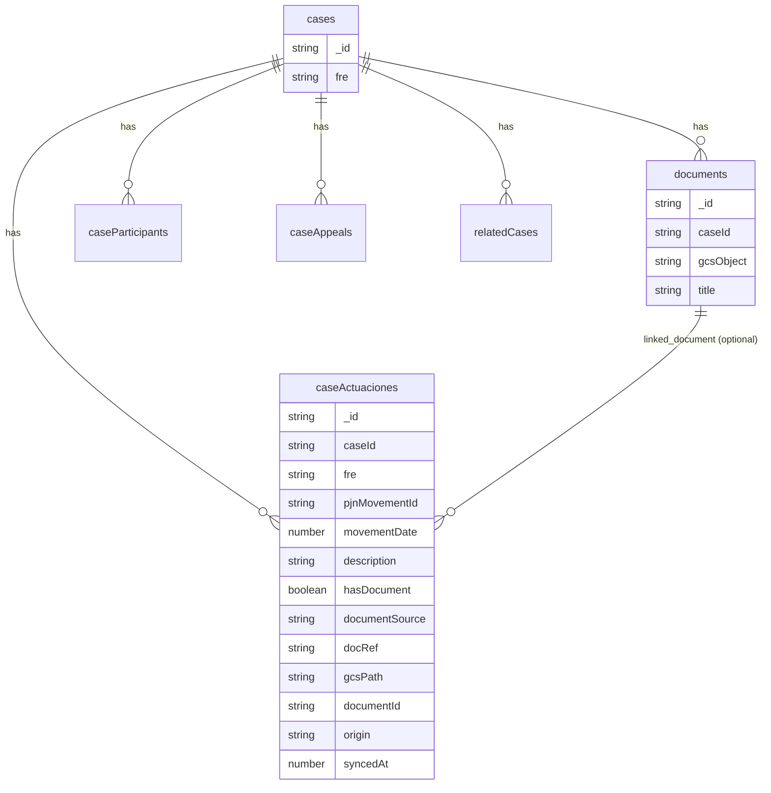

## PJN Actuaciones Data Model & Ingestion Plan

### 1. Target Domain Model (lawyer-centric)

- **Core idea**: Represent PJN case history as a first-class **Actuaciones table** where each row is a docket entry (movement) for a `case`, optionally linked to a stored document.
- **Keep existing tables** that are already domain-aligned:
  - `cases` (with `fre` and `lastPjnHistorySyncAt`)
  - `caseParticipants` (Intervinientes)
  - `caseAppeals` (Recursos)
  - `relatedCases` (Vinculados)
  - `documents` (file-level docs, including PJN PDFs)
  - `pjnActivityLog` (generic audit log; we keep it for traceability but stop relying on it for UI/history).
- **New PJN-specific tables** (high level):
  - `caseActuaciones` (or similar name) – normalized case history/Actuaciones per case.
  - Optional (if needed later): `pjnCaseHistorySyncJobs` for debugging / incremental sync metadata (not required for first iteration).

Mermaid ER sketch for the new relationships:

### 2. Convex Schema Changes (new tables & fields)

- **Add `caseActuaciones` table** in [`apps/application/convex/schema.ts`](apps/application/convex/schema.ts):
  - **Fields (proposed)**:
    - `caseId: v.id("cases")` – owning case.
    - `fre: v.optional(v.string())` – normalized FRE for redundancy / debugging.
    - `pjnMovementId: v.string()` – from scraper `NormalizedMovement.movementId` (idempotency key).
    - `movementDate: v.number()` – `Date` ms timestamp, derived from the scraper ISO string.
    - `rawDate: v.optional(v.string())` – original ISO/portal date string (for UI/debug, optional).
    - `description: v.string()` – actuación text.
    - `hasDocument: v.boolean()`.
    - `documentSource: v.optional(v.union(v.literal("actuaciones"), v.literal("doc_digitales")))`.
    - `docRef: v.optional(v.string())` – raw reference token/onclick/href used by scraper.
    - `gcsPath: v.optional(v.string())` – `gs://...` when scraper already uploaded PDF.
    - `documentId: v.optional(v.id("documents"))` – link to our own `documents` entry when we’ve created one.
    - `origin: v.union(v.literal("history_sync"), v.literal("notification"))` – where this entry came from (for future blending of real-time events and history sync).
    - `syncedFrom: v.literal("pjn")` and `syncedAt: v.number()` – traceability.
  - **Indexes**:
    - `by_case_and_date` → `["caseId", "movementDate"]` for Historial PJN UI ordering.
    - `by_case_and_pjn_id` → `["caseId", "pjnMovementId"]` for idempotent upserts.
    - Optional: `by_documentId` → `["documentId"]` for reverse lookup from a document.
- **Do *not* remove or change** `pjnActivityLog` yet; we’ll keep logging there as a secondary/audit layer.

### 3. Scraper Output Alignment (microservice side)

- **Leverage existing normalized types** in [`apps/pjn-scraper/src/types/api.ts`](apps/pjn-scraper/src/types/api.ts):
  - `NormalizedMovement`, `NormalizedDigitalDocument`, `CaseHistoryDetailsResponse`, etc. are already defined in a lawyer-friendly way (Actuaciones, Doc. digitales, Intervinientes, Recursos, Vinculados).
- **Ensure `/scrape/case-history/details` returns full data again** in [`apps/pjn-scraper/src/lib/caseHistoryDetails.ts`](apps/pjn-scraper/src/lib/caseHistoryDetails.ts):
  - Un-comment / re-enable steps that:
    - Load and parse `Doc. digitales` tab (`parseDocDigitalesHtml`).
    - Load and parse `Intervinientes`, `Recursos`, `Vinculados` tabs.
    - Fill `docDigitales`, `intervinientes`, `recursos`, `vinculados` on `CaseHistoryDetailsResult`.
  - Keep the existing **debug storage hooks** so we can inspect HTML and parsed JSON during rollout.
- **Document linkage hints**:
  - Rely on the existing `NormalizedMovement.docRef` and `NormalizedDigitalDocument.docRef` fields to correlate documents with movements.
  - If necessary later, we can refine the scraper to emit an explicit `linkedMovementId` on `NormalizedDigitalDocument` when it can be inferred reliably, but **first iteration can use docRef matching on the Convex side**.

### 4. Convex Ingestion Changes (history sync → Actuaciones)

- **New internal mutation for upserting actuaciones** in [`apps/application/convex/pjn/sync.ts`](apps/application/convex/pjn/sync.ts):
  - Create `upsertActuacion` (name placeholder) as `internalMutation`:
    - Args: `{ caseId, userId, movement }` where `movement` uses the same validator as in `createDocketMovementEntry` (plus we may pass parsed timestamp to avoid recomputing).
    - Behavior:
      - Look up existing row with index `by_case_and_pjn_id`.
      - If exists: `patch` any updated fields (description, gcsPath, hasDocument, etc.).
      - If not: `insert` into `caseActuaciones` with derived `movementDate` and metadata.
      - Optionally also write a `pjnActivityLog` entry (or keep using the existing `createDocketMovementEntry` for that part).
- **Wire history sync to the new table**:
  - In `syncCaseHistoryForCase` in [`apps/application/convex/pjn/caseHistory.ts`](apps/application/convex/pjn/caseHistory.ts), change ingestion loop:
    - For each `movement` in `detailsResult.movimientos`:
      - Call **both**:
        - `internal.pjn.sync.upsertActuacion` – to populate `caseActuaciones`.
        - Existing `internal.pjn.sync.createDocketMovementEntry` – to keep the audit log.
  - Keep the participant, appeals, and related cases ingestion as-is; they already map to `caseParticipants`, `caseAppeals`, and `relatedCases` in a lawyer-friendly way.

### 5. Convex Ingestion Changes (documents & linking)

- **Refine `createHistoricalDocumentEntry`** in [`apps/application/convex/pjn/sync.ts`](apps/application/convex/pjn/sync.ts) to update `caseActuaciones.documentId` when possible:
  - After inserting or reusing a `documents` row (`documentId`):
    - If `document.docRef` is present, query `caseActuaciones` using a small index scan (e.g., `withIndex("by_case_and_pjn_id")` + filter or a separate `by_case_and_docRef` index if needed) to find the matching actuación.
    - When found, `patch` that actuación with `documentId` and potentially `gcsPath` (if not already set from movement ingestion).
  - For digital documents without a matching movement (no `docRef` match):
    - **First iteration**: just create the `documents` row (as today) and skip creating a synthetic actuación; UI can later expose these as "Archivos del expediente" if needed.
- **Align movement ingestion with document downloads**:
  - `scrapeCaseHistoryDetails` currently downloads PDFs for movements with `docRef` and sets `movement.gcsPath`:
    - `syncCaseHistoryForCase` already passes those movements into `createDocketMovementEntry` / new `upsertActuacion`, so `gcsPath` should be stored in `caseActuaciones`.
  - `createHistoricalDocumentEntry` should treat `document.source` and `document.gcsPath` as **secondary normalization** that creates/links `documents` rows, not the primary history record.

### 6. Migration & Backwards Compatibility Strategy (no data move yet)

- **No immediate migration of existing rows**, per your preference:
  - Existing data in `pjnActivityLog` and any documents already created remain as-is.
  - New syncs going forward will start populating `caseActuaciones` for those cases.
- **Dual-read period (future, not in this iteration)**:
  - Once `caseActuaciones` is populated for newly synced cases, the Historial PJN UI can be updated to **prefer** `caseActuaciones` and only fall back to `pjnActivityLog` for legacy entries.
  - When you’re comfortable, we can plan a background Convex job to backfill `caseActuaciones` from existing `pjnActivityLog` metadata where possible.

### 7. Implementation Order

- **Step 1 – Schema**
  - Add `caseActuaciones` to `schema.ts` with fields and indexes above.
  - Deploy Convex schema change.
- **Step 2 – Scraper result completeness**
  - Re-enable full `CaseHistoryDetailsResult` population in `caseHistoryDetails.ts` so `movimientos` and `docDigitales` are reliable.
  - Confirm via debug storage that structures match `NormalizedMovement` / `NormalizedDigitalDocument` expectations.
- **Step 3 – Convex ingestion plumbing**
  - Implement `upsertActuacion` and call it from `syncCaseHistoryForCase` for each movement.
  - Extend `createHistoricalDocumentEntry` to set `caseActuaciones.documentId` when it can match on `caseId` + `docRef`.
- **Step 4 – Verification hooks (no UI changes yet)**
  - Add internal queries in `convex/pjn/` (or reuse existing ones) to list `caseActuaciones` for a given `caseId` ordered by `movementDate`.
  - Use these to sanity check that the stored history lines up with PJN’s Historial PJN UI for a few real cases.

### 8. Future-Proofing for the Historial PJN UI (for later)

- When you’re ready to update the UI, the new model will allow:
  - **Straightforward table rendering** of `caseActuaciones` (ordered by `movementDate`) with a simple boolean/`documentId` to show an "open PJN document" action.
  - Cross-linking from a docket row to the corresponding `documents` detail view when `documentId` is present.
  - Showing participants, appeals, and related cases from their dedicated tables, already normalized from PJN tabs.