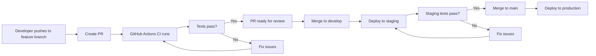

# CI/CD Deployment Guide for ialex-convex

## Overview

This guide outlines the recommended CI/CD approach for the ialex-convex project using **Coolify for deployment** and **GitHub Actions for CI**. This hybrid approach provides the simplicity of Coolify with the robustness of GitHub Actions for testing and quality assurance.

## Project Architecture

```
ialex-convex/
├── apps/
│   ├── application/           # Frontend + Convex Backend
│   │   ├── src/              # React + Vite frontend
│   │   ├── convex/           # Convex serverless functions
│   │   └── package.json
│   └── document-processor/   # Node.js microservice
│       ├── src/
│       ├── Dockerfile
│       └── package.json
├── packages/
│   ├── database/             # Shared database utilities
│   └── shared/               # Shared utilities
└── package.json              # Monorepo root
```

## Prerequisites

### Server Requirements
- **CPU**: 4 cores minimum (8 cores recommended)
- **RAM**: 8GB minimum (16GB recommended)
- **Storage**: 100GB SSD minimum
- **OS**: Ubuntu 20.04+ or Debian 11+
- **Network**: Stable internet connection for Docker pulls

### Required Services
- **Convex Cloud** account (for backend functions)
- **Google Cloud Storage** (for document storage)
- **Qdrant** (for vector database)
- **Redis** (for job queue)
- **Deepgram API** (for audio/video transcription)

## Phase 1: Infrastructure Setup

### 1.1 Server Preparation

```bash
# Update system
sudo apt update && sudo apt upgrade -y

# Install Docker
curl -fsSL https://get.docker.com -o get-docker.sh
sudo sh get-docker.sh
sudo usermod -aG docker $USER

# Install Docker Compose
sudo curl -L "https://github.com/docker/compose/releases/latest/download/docker-compose-$(uname -s)-$(uname -m)" -o /usr/local/bin/docker-compose
sudo chmod +x /usr/local/bin/docker-compose

# Install Coolify
curl -fsSL https://cdn.coollabs.io/coolify/install.sh | bash
```

### 1.2 Coolify Initial Setup

1. **Access Coolify Dashboard**
   ```bash
   # Get the setup URL
   sudo coolify setup
   ```

2. **Complete Initial Configuration**
   - Set admin email and password
   - Configure domain (e.g., `coolify.yourdomain.com`)
   - Set up SSL certificate
   - Configure backup settings

3. **Connect Source Control**
   - Add GitHub integration
   - Configure SSH keys for repository access

### 1.3 External Services Setup

#### Convex Cloud
```bash
# In your project directory
cd apps/application
npx convex dev --configure
# Follow prompts to create new project
```

#### Google Cloud Storage
1. Create GCS bucket
2. Generate service account key
3. Configure CORS for bucket

#### Qdrant Setup
```bash
# Using Docker
docker run -p 6333:6333 -p 6334:6334 \
  -v $(pwd)/qdrant_storage:/qdrant/storage:z \
  qdrant/qdrant
```

#### Redis Setup
```bash
# Using Docker
docker run -d --name redis \
  -p 6379:6379 \
  -v redis_data:/data \
  redis:7-alpine
```

## Phase 2: GitHub Actions CI Setup

### 2.1 Create GitHub Actions Workflow

Create `.github/workflows/ci.yml`:

```yaml
name: CI Pipeline
on:
  push:
    branches: [main, develop]
  pull_request:
    branches: [main]

env:
  PNPM_VERSION: 9.1.0
  NODE_VERSION: 18

jobs:
  lint-and-test:
    runs-on: ubuntu-latest
    steps:
      - name: Checkout code
        uses: actions/checkout@v4

      - name: Setup Node.js
        uses: actions/setup-node@v4
        with:
          node-version: ${{ env.NODE_VERSION }}

      - name: Setup pnpm
        uses: pnpm/action-setup@v2
        with:
          version: ${{ env.PNPM_VERSION }}

      - name: Get pnpm store directory
        shell: bash
        run: |
          echo "STORE_PATH=$(pnpm store path --silent)" >> $GITHUB_ENV

      - name: Setup pnpm cache
        uses: actions/cache@v3
        with:
          path: ${{ env.STORE_PATH }}
          key: ${{ runner.os }}-pnpm-store-${{ hashFiles('**/pnpm-lock.yaml') }}
          restore-keys: |
            ${{ runner.os }}-pnpm-store-

      - name: Install dependencies
        run: pnpm install --frozen-lockfile

      - name: Run linting
        run: pnpm lint

      - name: Type check
        run: pnpm tsc --noEmit

      - name: Build applications
        run: pnpm build

  security-scan:
    runs-on: ubuntu-latest
    needs: lint-and-test
    steps:
      - name: Checkout code
        uses: actions/checkout@v4

      - name: Run security audit
        run: pnpm audit --audit-level moderate

      - name: Run Snyk security scan
        uses: snyk/actions/node@master
        env:
          SNYK_TOKEN: ${{ secrets.SNYK_TOKEN }}
        with:
          args: --severity-threshold=high

  docker-build:
    runs-on: ubuntu-latest
    needs: lint-and-test
    if: github.event_name == 'push' && github.ref == 'refs/heads/main'
    steps:
      - name: Checkout code
        uses: actions/checkout@v4

      - name: Set up Docker Buildx
        uses: docker/setup-buildx-action@v3

      - name: Login to Container Registry
        uses: docker/login-action@v3
        with:
          registry: ${{ secrets.REGISTRY_URL }}
          username: ${{ secrets.REGISTRY_USERNAME }}
          password: ${{ secrets.REGISTRY_PASSWORD }}

      - name: Build and push document-processor
        uses: docker/build-push-action@v5
        with:
          context: ./apps/document-processor
          push: true
          tags: ${{ secrets.REGISTRY_URL }}/document-processor:${{ github.sha }}
          cache-from: type=gha
          cache-to: type=gha,mode=max

      - name: Build and push frontend
        uses: docker/build-push-action@v5
        with:
          context: ./apps/application
          push: true
          tags: ${{ secrets.REGISTRY_URL }}/frontend:${{ github.sha }}
          cache-from: type=gha
          cache-to: type=gha,mode=max
```

### 2.2 Required GitHub Secrets

Configure these secrets in your GitHub repository:

```bash
# Container Registry
REGISTRY_URL=your-registry.com
REGISTRY_USERNAME=your-username
REGISTRY_PASSWORD=your-password

# Security
SNYK_TOKEN=your-snyk-token

# Environment-specific
STAGING_CONVEX_URL=your-staging-convex-url
PRODUCTION_CONVEX_URL=your-production-convex-url
```

## Phase 3: Coolify Application Configuration

### 3.1 Create Application in Coolify

1. **Navigate to Coolify Dashboard**
2. **Create New Application**
   - Name: `ialex-convex`
   - Source: GitHub repository
   - Branch: `main`

### 3.2 Environment Configuration

#### Production Environment Variables

```bash
# Convex Configuration
CONVEX_URL=https://your-production-convex-url.convex.cloud
CONVEX_DEPLOY_KEY=your-production-deploy-key

# Document Processing
DEEPGRAM_API_KEY=your-deepgram-api-key
QDRANT_URL=http://your-qdrant-host:6333
REDIS_URL=redis://your-redis-host:6379

# Google Cloud Storage
GOOGLE_CLOUD_PROJECT_ID=your-project-id
GOOGLE_CLOUD_STORAGE_BUCKET=your-bucket-name
GOOGLE_APPLICATION_CREDENTIALS=/app/gcs-key.json

# Application Settings
NODE_ENV=production
PORT=4001
LOG_LEVEL=info
```

#### Staging Environment Variables

```bash
# Same as production but with staging URLs
CONVEX_URL=https://your-staging-convex-url.convex.cloud
CONVEX_DEPLOY_KEY=your-staging-deploy-key
# ... other variables with staging values
```

### 3.3 Docker Compose Configuration

Create `docker-compose.yml` in your repository root:

```yaml
version: '3.8'

services:
  frontend:
    image: ${REGISTRY_URL}/frontend:${IMAGE_TAG:-latest}
    ports:
      - "3000:3000"
    environment:
      - VITE_CONVEX_URL=${CONVEX_URL}
      - NODE_ENV=${NODE_ENV}
    depends_on:
      - document-processor
    networks:
      - ialex-network

  document-processor:
    image: ${REGISTRY_URL}/document-processor:${IMAGE_TAG:-latest}
    ports:
      - "4001:4001"
    environment:
      - DEEPGRAM_API_KEY=${DEEPGRAM_API_KEY}
      - QDRANT_URL=${QDRANT_URL}
      - REDIS_URL=${REDIS_URL}
      - GOOGLE_CLOUD_PROJECT_ID=${GOOGLE_CLOUD_PROJECT_ID}
      - GOOGLE_CLOUD_STORAGE_BUCKET=${GOOGLE_CLOUD_STORAGE_BUCKET}
      - NODE_ENV=${NODE_ENV}
      - PORT=4001
      - LOG_LEVEL=${LOG_LEVEL}
    volumes:
      - ./gcs-key.json:/app/gcs-key.json:ro
    depends_on:
      - qdrant
      - redis
    networks:
      - ialex-network

  qdrant:
    image: qdrant/qdrant:latest
    ports:
      - "6333:6333"
      - "6334:6334"
    volumes:
      - qdrant_data:/qdrant/storage
    networks:
      - ialex-network

  redis:
    image: redis:7-alpine
    ports:
      - "6379:6379"
    volumes:
      - redis_data:/data
    networks:
      - ialex-network

  nginx:
    image: nginx:alpine
    ports:
      - "80:80"
      - "443:443"
    volumes:
      - ./nginx.conf:/etc/nginx/nginx.conf:ro
      - ./ssl:/etc/nginx/ssl:ro
    depends_on:
      - frontend
      - document-processor
    networks:
      - ialex-network

volumes:
  qdrant_data:
  redis_data:

networks:
  ialex-network:
    driver: bridge
```

### 3.4 Nginx Configuration

Create `nginx.conf`:

```nginx
events {
    worker_connections 1024;
}

http {
    upstream frontend {
        server frontend:3000;
    }

    upstream document-processor {
        server document-processor:4001;
    }

    server {
        listen 80;
        server_name your-domain.com;
        return 301 https://$server_name$request_uri;
    }

    server {
        listen 443 ssl http2;
        server_name your-domain.com;

        ssl_certificate /etc/nginx/ssl/cert.pem;
        ssl_certificate_key /etc/nginx/ssl/key.pem;

        # Frontend
        location / {
            proxy_pass http://frontend;
            proxy_set_header Host $host;
            proxy_set_header X-Real-IP $remote_addr;
            proxy_set_header X-Forwarded-For $proxy_add_x_forwarded_for;
            proxy_set_header X-Forwarded-Proto $scheme;
        }

        # Document processor API
        location /api/processor/ {
            proxy_pass http://document-processor/;
            proxy_set_header Host $host;
            proxy_set_header X-Real-IP $remote_addr;
            proxy_set_header X-Forwarded-For $proxy_add_x_forwarded_for;
            proxy_set_header X-Forwarded-Proto $scheme;
        }

        # Health checks
        location /health {
            access_log off;
            return 200 "healthy\n";
            add_header Content-Type text/plain;
        }
    }
}
```

## Phase 4: Deployment Flow

### 4.1 Development Workflow



### 4.2 Automated Deployment Process

1. **Code Push to Main Branch**
   ```bash
   git push origin main
   ```

2. **GitHub Actions Triggers**
   - Runs linting and tests
   - Builds Docker images
   - Pushes to container registry

3. **Coolify Detects Changes**
   - Pulls latest images
   - Updates environment variables
   - Deploys new containers

4. **Health Checks**
   - Verifies all services are running
   - Checks database connectivity
   - Validates API endpoints

### 4.3 Manual Deployment Steps

If automated deployment fails:

```bash
# 1. SSH into server
ssh user@your-server

# 2. Navigate to Coolify directory
cd /data/coolify

# 3. Pull latest changes
git pull origin main

# 4. Rebuild and restart services
docker-compose down
docker-compose pull
docker-compose up -d

# 5. Check logs
docker-compose logs -f
```

## Phase 5: Monitoring and Maintenance

### 5.1 Health Monitoring

Create `health-check.sh`:

```bash
#!/bin/bash

# Check frontend
curl -f http://localhost:3000/health || exit 1

# Check document processor
curl -f http://localhost:4001/health || exit 1

# Check Qdrant
curl -f http://localhost:6333/health || exit 1

# Check Redis
redis-cli ping | grep PONG || exit 1

echo "All services healthy"
```

### 5.2 Log Management

Configure log rotation in `/etc/logrotate.d/ialex`:

```
/var/log/ialex/*.log {
    daily
    missingok
    rotate 30
    compress
    delaycompress
    notifempty
    create 644 root root
    postrotate
        docker-compose restart
    endscript
}
```

### 5.3 Backup Strategy

Create `backup.sh`:

```bash
#!/bin/bash

DATE=$(date +%Y%m%d_%H%M%S)
BACKUP_DIR="/backups/ialex"

# Create backup directory
mkdir -p $BACKUP_DIR

# Backup Qdrant data
docker run --rm -v qdrant_data:/data -v $BACKUP_DIR:/backup alpine tar czf /backup/qdrant_$DATE.tar.gz -C /data .

# Backup Redis data
docker run --rm -v redis_data:/data -v $BACKUP_DIR:/backup alpine tar czf /backup/redis_$DATE.tar.gz -C /data .

# Backup environment variables
cp .env $BACKUP_DIR/env_$DATE

# Clean old backups (keep 30 days)
find $BACKUP_DIR -name "*.tar.gz" -mtime +30 -delete
find $BACKUP_DIR -name "env_*" -mtime +30 -delete
```

## Phase 6: Troubleshooting

### 6.1 Common Issues

#### Document Processing Failures
```bash
# Check document processor logs
docker-compose logs document-processor

# Verify environment variables
docker-compose exec document-processor env | grep -E "(DEEPGRAM|QDRANT|REDIS)"

# Test API connectivity
curl -X POST http://localhost:4001/health
```

#### Frontend Issues
```bash
# Check frontend logs
docker-compose logs frontend

# Verify Convex connection
curl -f $CONVEX_URL/health

# Check build artifacts
docker-compose exec frontend ls -la /app/dist
```

#### Database Issues
```bash
# Check Qdrant status
curl http://localhost:6333/health

# Check Redis connectivity
redis-cli ping

# Verify data persistence
docker volume ls | grep qdrant
```

### 6.2 Performance Optimization

#### Resource Limits
Add to `docker-compose.yml`:

```yaml
services:
  document-processor:
    deploy:
      resources:
        limits:
          cpus: '2.0'
          memory: 2G
        reservations:
          cpus: '1.0'
          memory: 1G
```

#### Scaling
```bash
# Scale document processor
docker-compose up -d --scale document-processor=3

# Load balancer configuration
# Add to nginx.conf
upstream document-processor {
    server document-processor:4001;
    server document-processor:4002;
    server document-processor:4003;
}
```

## Phase 7: Feature Flag Implementation

### 7.1 Feature Flag Architecture Overview

Feature flags (also known as feature toggles) allow you to:
- **Gradually roll out features** to specific user segments
- **Quickly disable problematic features** without code deployment
- **A/B test different implementations** safely
- **Enable environment-specific features** (dev-only debugging tools)
- **Implement trunk-based development** with continuous deployment

### 7.2 Feature Flag Service Setup

#### 7.2.1 Convex Schema Updates

Add feature flags table to your Convex schema:

```typescript
// apps/application/convex/schema.ts
export default defineSchema({
  // ... existing tables ...
  
  featureFlags: defineTable({
    key: v.string(),
    enabled: v.boolean(),
    rolloutPercentage: v.optional(v.number()),
    targetUsers: v.optional(v.array(v.string())),
    targetRoles: v.optional(v.array(v.string())),
    targetEnvironments: v.optional(v.array(v.string())),
    metadata: v.optional(v.any()),
    createdAt: v.number(),
    updatedAt: v.number(),
    createdBy: v.id("users"),
  })
    .index("by_key", ["key"])
    .index("by_enabled", ["enabled"])
    .index("by_environment", ["targetEnvironments"]),
});
```

#### 7.2.2 Feature Flag Functions

Create `apps/application/convex/functions/featureFlags.ts`:

```typescript
import { v } from "convex/values";
import { query, mutation } from "./_generated/server";
import { api } from "../_generated/api";

export const getFlags = query({
  args: {
    userId: v.string(),
    environment: v.string(),
  },
  handler: async (ctx, args) => {
    const flags = await ctx.db.query("featureFlags").collect();
    
    return flags.filter(flag => {
      // Check environment targeting
      if (flag.targetEnvironments && !flag.targetEnvironments.includes(args.environment)) {
        return false;
      }
      
      // Check user targeting
      if (flag.targetUsers && !flag.targetUsers.includes(args.userId)) {
        return false;
      }
      
      return flag.enabled;
    });
  },
});

export const createFlag = mutation({
  args: {
    key: v.string(),
    enabled: v.boolean(),
    rolloutPercentage: v.optional(v.number()),
    targetUsers: v.optional(v.array(v.string())),
    targetRoles: v.optional(v.array(v.string())),
    targetEnvironments: v.optional(v.array(v.string())),
    metadata: v.optional(v.any()),
  },
  handler: async (ctx, args) => {
    const userId = await ctx.auth.getUserIdentity();
    if (!userId) throw new Error("Not authenticated");
    
    return await ctx.db.insert("featureFlags", {
      ...args,
      createdAt: Date.now(),
      updatedAt: Date.now(),
      createdBy: userId.subject as any,
    });
  },
});

export const updateFlag = mutation({
  args: {
    flagId: v.id("featureFlags"),
    updates: v.object({
      enabled: v.optional(v.boolean()),
      rolloutPercentage: v.optional(v.number()),
      targetUsers: v.optional(v.array(v.string())),
      targetRoles: v.optional(v.array(v.string())),
      targetEnvironments: v.optional(v.array(v.string())),
      metadata: v.optional(v.any()),
    }),
  },
  handler: async (ctx, args) => {
    const userId = await ctx.auth.getUserIdentity();
    if (!userId) throw new Error("Not authenticated");
    
    return await ctx.db.patch(args.flagId, {
      ...args.updates,
      updatedAt: Date.now(),
    });
  },
});
```

#### 7.2.3 Frontend Feature Flag Service

Create `apps/application/src/lib/featureFlags.ts`:

```typescript
export interface FeatureFlag {
  _id: string;
  key: string;
  enabled: boolean;
  rolloutPercentage?: number;
  targetUsers?: string[];
  targetRoles?: string[];
  targetEnvironments?: string[];
  metadata?: Record<string, any>;
}

export class FeatureFlagService {
  private flags: Map<string, FeatureFlag> = new Map();
  private userContext: { userId?: string; role?: string; environment: string };

  constructor(userContext: { userId?: string; role?: string; environment: string }) {
    this.userContext = userContext;
  }

  async loadFlags(): Promise<void> {
    // Flags will be loaded via React Query hook
  }

  isEnabled(flagKey: string): boolean {
    const flag = this.flags.get(flagKey);
    if (!flag) return false;
    if (!flag.enabled) return false;

    // Check environment targeting
    if (flag.targetEnvironments && !flag.targetEnvironments.includes(this.userContext.environment)) {
      return false;
    }

    // Check user targeting
    if (flag.targetUsers && this.userContext.userId && !flag.targetUsers.includes(this.userContext.userId)) {
      return false;
    }

    // Check role targeting
    if (flag.targetRoles && this.userContext.role && !flag.targetRoles.includes(this.userContext.role)) {
      return false;
    }

    // Check rollout percentage
    if (flag.rolloutPercentage && this.userContext.userId) {
      const hash = this.hashUserId(this.userContext.userId);
      return hash % 100 < flag.rolloutPercentage;
    }

    return true;
  }

  private hashUserId(userId: string): number {
    let hash = 0;
    for (let i = 0; i < userId.length; i++) {
      const char = userId.charCodeAt(i);
      hash = ((hash << 5) - hash) + char;
      hash = hash & hash;
    }
    return Math.abs(hash);
  }
}
```

#### 7.2.4 React Hooks

Create `apps/application/src/hooks/useFeatureFlags.ts`:

```typescript
import { useQuery } from "convex/react";
import { api } from "../convex/_generated/api";
import { useAuth } from "@clerk/clerk-react";

export function useFeatureFlags() {
  const { userId } = useAuth();
  const user = useQuery(api.functions.users.getCurrentUser);
  
  const flags = useQuery(api.functions.featureFlags.getFlags, {
    userId: userId || "",
    environment: import.meta.env.MODE,
  });

  const isEnabled = (flagKey: string): boolean => {
    const flag = flags?.find(f => f.key === flagKey);
    if (!flag || !flag.enabled) return false;
    
    // Check environment targeting
    if (flag.targetEnvironments && !flag.targetEnvironments.includes(import.meta.env.MODE)) {
      return false;
    }
    
    // Check user targeting
    if (flag.targetUsers && userId && !flag.targetUsers.includes(userId)) {
      return false;
    }
    
    // Check role targeting
    if (flag.targetRoles && user?.role && !flag.targetRoles.includes(user.role)) {
      return false;
    }
    
    // Check rollout percentage
    if (flag.rolloutPercentage && userId) {
      const hash = hashUserId(userId);
      return hash % 100 < flag.rolloutPercentage;
    }
    
    return true;
  };

  return { isEnabled, flags };
}

function hashUserId(userId: string): number {
  let hash = 0;
  for (let i = 0; i < userId.length; i++) {
    const char = userId.charCodeAt(i);
    hash = ((hash << 5) - hash) + char;
    hash = hash & hash;
  }
  return Math.abs(hash);
}
```

#### 7.2.5 Feature Flag Component

Create `apps/application/src/components/FeatureFlag.tsx`:

```typescript
import { useFeatureFlags } from "../hooks/useFeatureFlags";

interface FeatureFlagProps {
  flag: string;
  children: React.ReactNode;
  fallback?: React.ReactNode;
}

export function FeatureFlag({ flag, children, fallback }: FeatureFlagProps) {
  const { isEnabled } = useFeatureFlags();
  
  if (isEnabled(flag)) {
    return <>{children}</>;
  }
  
  return fallback ? <>{fallback}</> : null;
}
```

### 7.3 Environment Configuration

#### 7.3.1 Environment Variables

Add feature flag configuration to your environment variables:

```bash
# Feature Flag Configuration
FEATURE_FLAGS_ENABLED=true
FEATURE_FLAGS_CACHE_TTL=300
FEATURE_FLAGS_DEFAULT_ENVIRONMENT=production
```

#### 7.3.2 Docker Compose Updates

Update your `docker-compose.yml` to include feature flag environment variables:

```yaml
services:
  frontend:
    image: ${REGISTRY_URL}/frontend:${IMAGE_TAG:-latest}
    ports:
      - "3000:3000"
    environment:
      - VITE_CONVEX_URL=${CONVEX_URL}
      - NODE_ENV=${NODE_ENV}
      - VITE_FEATURE_FLAGS_ENABLED=${FEATURE_FLAGS_ENABLED}
      - VITE_FEATURE_FLAGS_CACHE_TTL=${FEATURE_FLAGS_CACHE_TTL}
    depends_on:
      - document-processor
    networks:
      - ialex-network
```

### 7.4 Feature Flag Management

#### 7.4.1 Admin Interface

Create a feature flag management interface for administrators:

```typescript
// apps/application/src/components/Admin/FeatureFlagManager.tsx
import { useState } from "react";
import { useMutation, useQuery } from "convex/react";
import { api } from "../../convex/_generated/api";

export function FeatureFlagManager() {
  const flags = useQuery(api.functions.featureFlags.getFlags, {
    userId: "",
    environment: "all",
  });
  
  const createFlag = useMutation(api.functions.featureFlags.createFlag);
  const updateFlag = useMutation(api.functions.featureFlags.updateFlag);
  
  const [newFlag, setNewFlag] = useState({
    key: "",
    enabled: false,
    rolloutPercentage: 100,
    targetEnvironments: ["production"],
  });
  
  const handleCreateFlag = async () => {
    await createFlag(newFlag);
    setNewFlag({ key: "", enabled: false, rolloutPercentage: 100, targetEnvironments: ["production"] });
  };
  
  const toggleFlag = async (flagId: string, enabled: boolean) => {
    await updateFlag({ flagId: flagId as any, updates: { enabled } });
  };
  
  return (
    <div className="p-6">
      <h2 className="text-2xl font-bold mb-4">Feature Flag Management</h2>
      
      {/* Create new flag */}
      <div className="mb-6 p-4 border rounded">
        <h3 className="text-lg font-semibold mb-2">Create New Flag</h3>
        <div className="space-y-2">
          <input
            type="text"
            placeholder="Flag key (e.g., new-document-viewer)"
            value={newFlag.key}
            onChange={(e) => setNewFlag({ ...newFlag, key: e.target.value })}
            className="w-full p-2 border rounded"
          />
          <div className="flex items-center space-x-4">
            <label className="flex items-center">
              <input
                type="checkbox"
                checked={newFlag.enabled}
                onChange={(e) => setNewFlag({ ...newFlag, enabled: e.target.checked })}
                className="mr-2"
              />
              Enabled
            </label>
            <input
              type="number"
              placeholder="Rollout %"
              value={newFlag.rolloutPercentage}
              onChange={(e) => setNewFlag({ ...newFlag, rolloutPercentage: parseInt(e.target.value) })}
              className="w-24 p-2 border rounded"
            />
          </div>
          <button
            onClick={handleCreateFlag}
            className="px-4 py-2 bg-blue-500 text-white rounded hover:bg-blue-600"
          >
            Create Flag
          </button>
        </div>
      </div>
      
      {/* Existing flags */}
      <div className="space-y-2">
        {flags?.map((flag) => (
          <div key={flag._id} className="p-4 border rounded flex items-center justify-between">
            <div>
              <h4 className="font-semibold">{flag.key}</h4>
              <p className="text-sm text-gray-600">
                Rollout: {flag.rolloutPercentage}% | 
                Environments: {flag.targetEnvironments?.join(", ") || "all"}
              </p>
            </div>
            <button
              onClick={() => toggleFlag(flag._id, !flag.enabled)}
              className={`px-3 py-1 rounded ${
                flag.enabled 
                  ? "bg-green-500 text-white" 
                  : "bg-gray-300 text-gray-700"
              }`}
            >
              {flag.enabled ? "Enabled" : "Disabled"}
            </button>
          </div>
        ))}
      </div>
    </div>
  );
}
```

### 7.5 Usage Examples

#### 7.5.1 Gradual Feature Rollout

```typescript
// Roll out new AI features to 10% of users first
{
  key: "enhanced-ai-assistant",
  enabled: true,
  rolloutPercentage: 10,
  targetEnvironments: ["production"]
}

// In your component
<FeatureFlag flag="enhanced-ai-assistant">
  <EnhancedAIAssistant />
</FeatureFlag>
```

#### 7.5.2 Environment-Specific Features

```typescript
// Enable debugging features only in development
{
  key: "debug-mode",
  enabled: true,
  targetEnvironments: ["development"]
}

// In your component
<FeatureFlag flag="debug-mode">
  <DebugPanel />
</FeatureFlag>
```

#### 7.5.3 User Role-Based Features

```typescript
// Premium features for specific user roles
{
  key: "advanced-analytics",
  enabled: true,
  targetRoles: ["admin", "premium"]
}

// In your component
<FeatureFlag flag="advanced-analytics">
  <AdvancedAnalytics />
</FeatureFlag>
```

#### 7.5.4 Emergency Feature Disabling

```typescript
// Quickly disable problematic features
{
  key: "document-ai-processing",
  enabled: false, // Disable immediately
  targetEnvironments: ["production"]
}
```

### 7.6 CI/CD Integration

#### 7.6.1 GitHub Actions Updates

Update your GitHub Actions workflow to include feature flag testing:

```yaml
# Add to your existing CI workflow
- name: Test feature flags
  run: |
    # Test feature flag functionality
    pnpm test:feature-flags
    
- name: Validate feature flag schema
  run: |
    # Validate feature flag configuration
    pnpm validate:feature-flags
```

#### 7.6.2 Deployment Strategy

Feature flags enable new deployment strategies:

```yaml
# apps/application/.github/workflows/deploy-with-flags.yml
name: Deploy with Feature Flags
on:
  push:
    branches: [main]

jobs:
  deploy:
    runs-on: ubuntu-latest
    steps:
      - name: Deploy to staging
        run: |
          # Deploy with feature flags disabled by default
          echo "Deploying to staging with feature flags disabled"
          
      - name: Enable feature flags for testing
        run: |
          # Enable specific flags for staging testing
          curl -X POST $STAGING_API/feature-flags/enable \
            -H "Content-Type: application/json" \
            -d '{"key": "new-feature", "enabled": true, "rolloutPercentage": 100}'
          
      - name: Run staging tests
        run: |
          # Run tests with feature flags enabled
          pnpm test:staging
          
      - name: Deploy to production
        if: success()
        run: |
          # Deploy to production with gradual rollout
          echo "Deploying to production with 10% rollout"
          curl -X POST $PRODUCTION_API/feature-flags/enable \
            -H "Content-Type: application/json" \
            -d '{"key": "new-feature", "enabled": true, "rolloutPercentage": 10}'
```

### 7.7 Monitoring and Analytics

#### 7.7.1 Feature Flag Metrics

Track feature flag usage and performance:

```typescript
// apps/application/convex/functions/featureFlagAnalytics.ts
export const trackFeatureFlagUsage = mutation({
  args: {
    flagKey: v.string(),
    userId: v.string(),
    action: v.string(), // "view", "click", "error"
    metadata: v.optional(v.any()),
  },
  handler: async (ctx, args) => {
    // Store analytics data
    await ctx.db.insert("featureFlagAnalytics", {
      flagKey: args.flagKey,
      userId: args.userId,
      action: args.action,
      metadata: args.metadata,
      timestamp: Date.now(),
    });
  },
});
```

#### 7.7.2 Health Checks

Add feature flag health checks to your monitoring:

```bash
#!/bin/bash
# health-check-with-flags.sh

# Check feature flag service
curl -f http://localhost:3000/api/feature-flags/health || exit 1

# Check feature flag database connectivity
curl -f $CONVEX_URL/feature-flags/health || exit 1

echo "Feature flags healthy"
```

## Phase 8: Security Considerations

### 8.1 Network Security
- Use internal Docker networks
- Expose only necessary ports
- Implement rate limiting in Nginx

### 8.2 Secrets Management
- Store sensitive data in Coolify secrets
- Use environment-specific configurations
- Rotate API keys regularly

### 8.3 Access Control
- Implement proper authentication
- Use HTTPS everywhere
- Regular security audits

### 8.4 Feature Flag Security
- Restrict feature flag management to admin users only
- Audit feature flag changes
- Validate feature flag configuration before deployment

## Conclusion

This CI/CD setup provides:
- **Automated testing** with GitHub Actions
- **Simple deployments** with Coolify
- **Scalable infrastructure** with Docker
- **Monitoring and backup** capabilities
- **Easy troubleshooting** and maintenance

The hybrid approach leverages the best of both worlds: GitHub Actions' robust CI capabilities and Coolify's simple deployment interface.

## Next Steps

1. Set up the server infrastructure
2. Configure GitHub Actions
3. Deploy to staging environment
4. Test the complete pipeline
5. Deploy to production
6. Set up monitoring and alerts
7. Document team procedures

For questions or issues, refer to the troubleshooting section or contact the DevOps team.
