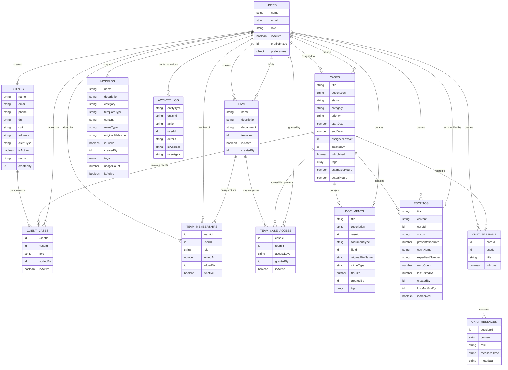

# Database Schema Documentation

This document describes the complete database schema for the iAlex legal document management application.

> **📋 Authentication Update**: This application now uses Clerk authentication with a comprehensive onboarding system. See [Authentication & Onboarding Setup](./authentication-setup.md) for complete setup instructions.

## Overview

The iAlex application uses Convex as its backend database. The schema is designed to support:
- Legal case management with many-to-many client relationships
- Document and escrito (legal writing) handling
- Team-based access control system
- AI-powered chat features
- Independent template system (modelos)
- User management with Clerk authentication integration
- Comprehensive user onboarding and professional profiles

## Entity Relationship Diagram

## Core Entities

### Users (`users`)
Stores user authentication and profile information.

**Fields:**
- `name`: User's full name
- `email`: Unique email address
- `role`: User role (`admin`, `lawyer`, `assistant`)
- `isActive`: Whether the user account is active
- `profileImage`: Optional reference to stored profile image
- `preferences`: User preferences (language, timezone, notifications)

**Key Indexes:**
- `by_email`: Fast user lookup by email
- `by_role`: Query users by role
- `by_active_status`: Filter active/inactive users

### Clients (`clients`)
Legal clients that can be associated with multiple cases.

**Fields:**
- `name`: Client name (individual or company)
- `email`, `phone`: Contact information
- `dni`: DNI for individual identification
- `cuit`: CUIT for tax identification
- `address`: Client address
- `clientType`: Either `individual` or `company`
- `isActive`: Whether client is active
- `notes`: Additional notes about the client
- `createdBy`: User who created the client record

**Key Indexes:**
- `by_dni`, `by_cuit`: Fast lookup by identification numbers
- `by_email`: Contact lookup
- `by_created_by`: Track who created clients
- `by_active_status`: Filter active/inactive clients

### Cases (`cases`)
Legal cases managed by the firm.

**Fields:**
- `title`: Case title/name
- `description`: Case description
- `status`: Current status (`pendiente`, `en progreso`, `completado`, `archivado`, `cancelado`)
- `category`: Legal category (e.g., "Derecho Civil", "Derecho Mercantil")
- `priority`: Case priority (`low`, `medium`, `high`)
- `startDate`: Case start date
- `endDate`: Case completion date (optional)
- `assignedLawyer`: Lawyer assigned to the case
- `createdBy`: User who created the case
- `isArchived`: Whether case is archived
- `tags`: Array of case tags
- `estimatedHours`: Estimated hours for case
- `actualHours`: Actual hours spent on case

**Key Indexes:**
- `by_status`: Query cases by status
- `by_assigned_lawyer`: Cases assigned to specific lawyers
- `by_created_by`: Cases created by specific users
- `by_archived_status`: Filter archived/active cases
- `by_priority`: Query by priority level

### Client-Case Relationships (`clientCases`)
Many-to-many relationship between clients and cases.

**Fields:**
- `clientId`: Reference to client
- `caseId`: Reference to case
- `role`: Client's role in the case (e.g., "plaintiff", "defendant", "witness")
- `addedBy`: User who added this relationship
- `isActive`: Whether relationship is active

**Key Indexes:**
- `by_client`: All cases for a client
- `by_case`: All clients for a case
- `by_client_and_case`: Unique constraint lookup
- `by_added_by`: Track who added relationships
- `by_active_status`: Filter active relationships

## Team Management

### Teams (`teams`)
Organizational teams/departments within the firm.

**Fields:**
- `name`: Team name
- `description`: Team description
- `department`: Department (e.g., "Corporate Law", "Family Law")
- `teamLead`: User who leads the team
- `isActive`: Whether team is active
- `createdBy`: User who created the team

**Key Indexes:**
- `by_department`: Query teams by department
- `by_team_lead`: Teams led by specific users
- `by_active_status`: Filter active teams
- `by_created_by`: Track team creators

### Team Memberships (`teamMemberships`)
Many-to-many relationship between users and teams.

**Fields:**
- `teamId`: Reference to team
- `userId`: Reference to user
- `role`: User's role in team (`secretario`, `abogado`, `admin`)
- `joinedAt`: When user joined the team
- `addedBy`: User who added this member
- `isActive`: Whether membership is active

**Key Indexes:**
- `by_team`: All members of a team
- `by_user`: All teams for a user
- `by_team_and_user`: Unique constraint lookup
- `by_role`: Query by team role
- `by_active_status`: Filter active memberships

### Team Case Access (`teamCaseAccess`)
Grants teams access to specific cases.

**Fields:**
- `caseId`: Reference to case
- `teamId`: Reference to team
- `accessLevel`: Access level (`full` for edit, `read` for view-only)
- `grantedBy`: User who granted the access
- `isActive`: Whether access is active

**Key Indexes:**
- `by_case`: All teams with access to a case
- `by_team`: All cases accessible by a team
- `by_case_and_team`: Unique constraint lookup
- `by_access_level`: Query by access level
- `by_granted_by`: Track who granted access
- `by_active_status`: Filter active access grants

## Document Management

### Documents (`documents`)
File-based documents stored in Convex storage.

**Fields:**
- `title`: Document title
- `description`: Document description
- `caseId`: Reference to case
- `documentType`: Type of document (`contract`, `evidence`, `correspondence`, `legal_brief`, `court_filing`, `other`)
- `fileId`: Reference to file in Convex storage
- `originalFileName`: Original filename when uploaded
- `mimeType`: File MIME type
- `fileSize`: File size in bytes
- `createdBy`: User who uploaded the document
- `tags`: Array of document tags

**Key Indexes:**
- `by_case`: All documents for a case
- `by_type`: Query by document type
- `by_created_by`: Documents created by specific users
- `by_file_id`: Lookup by storage file ID

### Escritos (`escritos`)
Tiptap JSON documents for legal writings/briefs.

**Fields:**
- `title`: Escrito title
- `content`: Tiptap JSON content
- `caseId`: Reference to case
- `status`: Current status (`borrador`, `terminado`)
- `presentationDate`: When escrito was presented
- `courtName`: Court where escrito was presented
- `expedientNumber`: Court expedient number
- `wordCount`: Calculated word count
- `lastEditedAt`: When content was last modified
- `createdBy`: User who created the escrito
- `lastModifiedBy`: User who last modified the escrito
- `isArchived`: Whether escrito is archived

**Key Indexes:**
- `by_case`: All escritos for a case
- `by_status`: Query by escrito status
- `by_created_by`: Escritos created by specific users
- `by_archived_status`: Filter archived escritos
- `by_presentation_date`: Query by presentation date
- `by_last_edited`: Query by last edit time

### Modelos (Templates) (`modelos`)
Independent reusable templates for documents and escritos.

**Fields:**
- `name`: Template name
- `description`: Template description
- `category`: Legal category
- `templateType`: Type (`escrito` for Tiptap JSON, `document` for files)
- `content`: Tiptap JSON template content (for escrito templates)
- `mimeType`: File MIME type (for document templates)
- `originalFileName`: Original filename (for document templates)
- `isPublic`: Whether template is public (true) or team-only (false)
- `createdBy`: User who created the template
- `tags`: Array of template tags
- `usageCount`: Number of times template has been used
- `isActive`: Whether template is active

**Key Indexes:**
- `by_category`: Query templates by category
- `by_type`: Query by template type
- `by_created_by`: Templates created by specific users
- `by_public_status`: Filter public/private templates
- `by_active_status`: Filter active templates

## AI & Communication

### Chat Sessions (`chatSessions`)
AI chat conversations, optionally linked to specific cases.

**Fields:**
- `caseId`: Optional reference to case
- `userId`: User participating in chat
- `title`: Optional chat title
- `isActive`: Whether session is active

**Key Indexes:**
- `by_case`: Chat sessions for a specific case
- `by_user`: Chat sessions for a specific user
- `by_active_status`: Filter active sessions

### Chat Messages (`chatMessages`)
Individual messages within chat sessions.

**Fields:**
- `sessionId`: Reference to chat session
- `content`: Message content
- `role`: Message sender (`user` or `assistant`)
- `messageType`: Type of message (`text`, `document_analysis`, `template_suggestion`, `legal_advice`)
- `metadata`: Optional JSON metadata

**Key Indexes:**
- `by_session`: All messages in a session
- `by_role`: Query by message sender

## Activity & Audit

### Activity Log (`activityLog`)
Comprehensive audit trail for all system actions.

**Fields:**
- `entityType`: Type of entity (`case`, `document`, `escrito`, `client`, `user`)
- `entityId`: ID of the affected entity
- `action`: Action performed (`created`, `updated`, `deleted`, `viewed`, `shared`, `archived`, `restored`)
- `userId`: User who performed the action
- `details`: Optional JSON details about the action
- `ipAddress`: User's IP address
- `userAgent`: User's browser/client info

**Key Indexes:**
- `by_entity`: All actions on a specific entity
- `by_user`: All actions by a specific user
- `by_action`: Query by action type

## Access Control Model

### Direct Access
Users have direct access to cases if they are:
- The assigned lawyer (`cases.assignedLawyer`)
- The case creator (`cases.createdBy`)

### Team-Based Access
Users inherit access to cases through team membership:
- **Full Access**: Can view and edit all case content
- **Read Access**: Can only view case content

### Access Hierarchy
1. **Direct Access**: Always takes precedence (full access)
2. **Team Access**: Inherited through active team memberships
3. **User Roles**: System-level permissions (`admin`, `lawyer`, `assistant`)

## Key Design Principles

### Simplified Architecture
- **No Document Versioning**: Documents are standalone files
- **No Escrito Versioning**: Escritos are simple, independent documents
- **Independent Templates**: Modelos are completely separate from regular documents
- **Case-Focused Chat**: AI conversations are linked to cases, not individual documents

### Many-to-Many Relationships
- **Client-Case**: Multiple clients can be involved in a case, and clients can have multiple cases
- **User-Team**: Users can belong to multiple teams with different roles
- **Team-Case**: Teams can have access to multiple cases with different permission levels

### Soft Deletes
Most entities use `isActive` or `isArchived` flags instead of hard deletes to maintain data integrity and audit trails.

### Comprehensive Indexing
Strategic database indexes ensure fast queries for common use cases like filtering by status, searching by user, and accessing case-related content. 

## Node-only Firestore Access

Firestore access is isolated to `convex/functions/legalDb.ts`, which uses the `'use node'` directive. All other Convex functions remain browser-safe and do not use Node.js APIs. Do NOT re-export node-only functions (like `fetchLegalDb`) from `index.ts` or `myFunctions.ts`. Import them directly from their files if needed. 