# Funcionalidades de Integración PJN para iAlex

Basándose en la arquitectura del portal PJN y su sistema actual de gestión de casos iAlex, aquí están las funcionalidades clave que pueden implementarse, organizadas por valor y complejidad.

---

## 1. Monitoreo e Ingesta Automática de Notificaciones

**Descripción**: Sincronizar automáticamente todas las notificaciones judiciales del portal PJN en iAlex, eliminando la verificación manual y asegurando que los abogados nunca pierdan comunicaciones críticas del tribunal.

**Valor para el Usuario**:
- **Cero notificaciones perdidas**: Cron job ejecutándose cada 15-30 minutos verificando nuevos eventos
- **Conciencia instantánea**: Notificaciones push o alertas por email cuando llegan nuevos documentos del tribunal
- **Bandeja centralizada**: Todas las notificaciones PJN aparecen junto a documentos internos de iAlex en una línea de tiempo unificada del caso

**Flujo Técnico**:

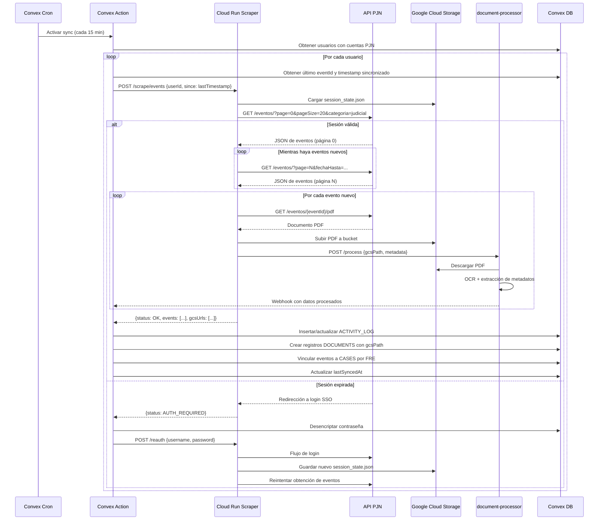
```mermaid
sequenceDiagram
    participant Cron as Convex Cron
    participant Convex as Convex Action
    participant CloudRun as Cloud Run Scraper
    participant PJN as API PJN
    participant GCS as Google Cloud Storage
    participant DocProc as document-processor
    participant DB as Convex DB

    Cron->>Convex: Activar sync (cada 15 min)
    Convex->>DB: Obtener usuarios con cuentas PJN
    loop Por cada usuario
        Convex->>DB: Obtener último eventId y timestamp sincronizado
        Convex->>CloudRun: POST /scrape/events {userId, since: lastTimestamp}
        CloudRun->>GCS: Cargar session_state.json
        CloudRun->>PJN: GET /eventos/?page=0&pageSize=20&categoria=judicial
        alt Sesión válida
            PJN-->>CloudRun: JSON de eventos (página 0)
            loop Mientras haya eventos nuevos
                CloudRun->>PJN: GET /eventos/?page=N&fechaHasta=...
                PJN-->>CloudRun: JSON de eventos (página N)
            end
            loop Por cada evento nuevo
                CloudRun->>PJN: GET /eventos/{eventId}/pdf
                PJN-->>CloudRun: Documento PDF
                CloudRun->>GCS: Subir PDF a bucket
                CloudRun->>DocProc: POST /process {gcsPath, metadata}
                DocProc->>GCS: Descargar PDF
                DocProc->>DocProc: OCR + extracción de metadatos
                DocProc-->>Convex: Webhook con datos procesados
            end
            CloudRun-->>Convex: {status: OK, events: [...], gcsUrls: [...]}
            Convex->>DB: Insertar/actualizar ACTIVITY_LOG
            Convex->>DB: Crear registros DOCUMENTS con gcsPath
            Convex->>DB: Vincular eventos a CASES por FRE
            Convex->>DB: Actualizar lastSyncedAt
        else Sesión expirada
            PJN-->>CloudRun: Redirección a login SSO
            CloudRun-->>Convex: {status: AUTH_REQUIRED}
            Convex->>DB: Desencriptar contraseña
            Convex->>CloudRun: POST /reauth {username, password}
            CloudRun->>PJN: Flujo de login
            CloudRun->>GCS: Guardar nuevo session_state.json
            CloudRun->>PJN: Reintentar obtención de eventos
        end
    end
```

**Mapeo de Datos**:
- `api.pjn.gov.ar/eventos` → `ACTIVITY_LOG` (action: "pjn_notification_received")
- `api.pjn.gov.ar/eventos/{id}/pdf` → GCS → `document-processor` → `DOCUMENTS` (sourceSystem: "PJN-Portal", gcsPath: "gs://bucket/pjn/...")
- FRE del evento → `CASES` (externalCaseId: "FRE 7262/2025/CFC1")

---

## 2. Descubrimiento Inteligente de Casos y Auto-Vinculación

**Descripción**: Descubrir automáticamente todos los casos vinculados a la cuenta PJN del usuario y emparejarlos con casos existentes de iAlex o sugerir crear nuevos, con emparejamiento inteligente de partes.

**Valor para el Usuario**:
- **Sin entrada manual de casos**: Los casos del PJN aparecen automáticamente en iAlex
- **Emparejamiento inteligente de clientes**: El sistema sugiere qué clientes internos coinciden con las partes del PJN basándose en nombre/DNI
- **Brechas de cobertura**: Alerta cuando existe un caso PJN pero aún no se rastrea en iAlex

**Flujo Técnico**:

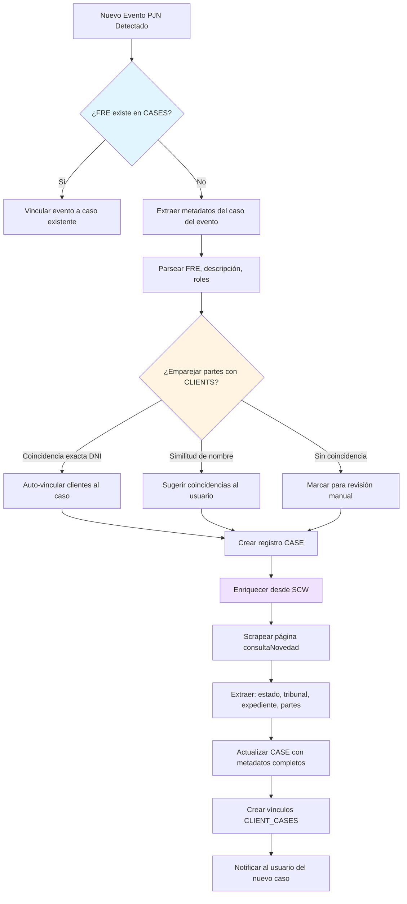
```mermaid
flowchart TD
    A[Nuevo Evento PJN Detectado] --> B{¿FRE existe en CASES?}
    B -->|Sí| C[Vincular evento a caso existente]
    B -->|No| D[Extraer metadatos del caso del evento]
    D --> E[Parsear FRE, descripción, roles]
    E --> F{¿Emparejar partes con CLIENTS?}
    F -->|Coincidencia exacta DNI| G[Auto-vincular clientes al caso]
    F -->|Similitud de nombre| H[Sugerir coincidencias al usuario]
    F -->|Sin coincidencia| I[Marcar para revisión manual]
    G --> J[Crear registro CASE]
    H --> J
    I --> J
    J --> K[Enriquecer desde SCW]
    K --> L[Scrapear página consultaNovedad]
    L --> M[Extraer: estado, tribunal, expediente, partes]
    M --> N[Actualizar CASE con metadatos completos]
    N --> O[Crear vínculos CLIENT_CASES]
    O --> P[Notificar al usuario del nuevo caso]
    
    style B fill:#e1f5ff
    style F fill:#fff4e1
    style K fill:#f0e1ff
```

**Algoritmo de Emparejamiento de Partes**:
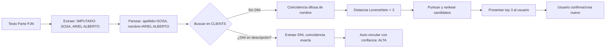
```mermaid
graph LR
    A[Texto Parte PJN] --> B[Extraer: IMPUTADO: SOSA, ARIEL ALBERTO]
    B --> C[Parsear: apellido=SOSA, nombre=ARIEL ALBERTO]
    C --> D{Buscar en CLIENTS}
    D -->|¿DNI en descripción?| E[Extraer DNI, coincidencia exacta]
    D -->|Sin DNI| F[Coincidencia difusa de nombre]
    F --> G[Distancia Levenshtein < 3]
    G --> H[Puntuar y rankear candidatos]
    H --> I[Presentar top 3 al usuario]
    E --> J[Auto-vincular con confianza: ALTA]
    I --> K[Usuario confirma/crea nuevo]
```

---

## 3. Sincronización Completa del Expediente del Caso

**Descripción**: Para cada caso, scrapear el historial procesal completo (expediente/movimientos) del SCW y mostrarlo como una línea de tiempo unificada en iAlex junto con actividades internas.

**Valor para el Usuario**:
- **Historial completo del caso**: Cada acción del tribunal, presentación y audiencia en un solo lugar
- **Perspectivas procesales**: Ver progresión del caso, demoras y plazos próximos
- **Pista de auditoría**: Saber exactamente cuándo se presentaron documentos y se emitieron decisiones

**Flujo Técnico**:

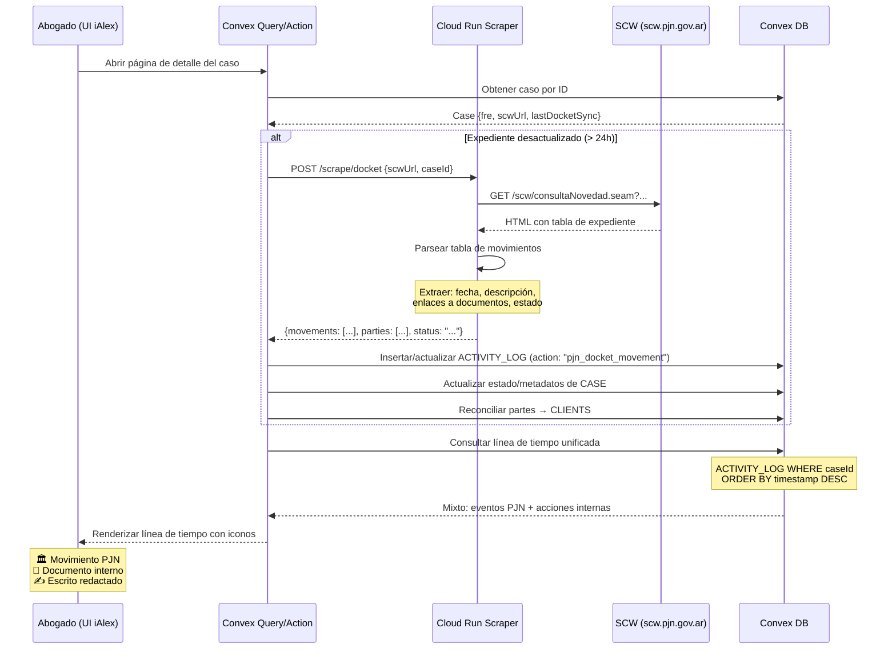
```mermaid
sequenceDiagram
    participant User as Abogado (UI iAlex)
    participant Convex as Convex Query/Action
    participant CloudRun as Cloud Run Scraper
    participant SCW as SCW (scw.pjn.gov.ar)
    participant DB as Convex DB

    User->>Convex: Abrir página de detalle del caso
    Convex->>DB: Obtener caso por ID
    DB-->>Convex: Case {fre, scwUrl, lastDocketSync}
    alt Expediente desactualizado (> 24h)
        Convex->>CloudRun: POST /scrape/docket {scwUrl, caseId}
        CloudRun->>SCW: GET /scw/consultaNovedad.seam?...
        SCW-->>CloudRun: HTML con tabla de expediente
        CloudRun->>CloudRun: Parsear tabla de movimientos
        Note over CloudRun: Extraer: fecha, descripción,<br/>enlaces a documentos, estado
        CloudRun-->>Convex: {movements: [...], parties: [...], status: "..."}
        Convex->>DB: Insertar/actualizar ACTIVITY_LOG (action: "pjn_docket_movement")
        Convex->>DB: Actualizar estado/metadatos de CASE
        Convex->>DB: Reconciliar partes → CLIENTS
    end
    Convex->>DB: Consultar línea de tiempo unificada
    Note over DB: ACTIVITY_LOG WHERE caseId<br/>ORDER BY timestamp DESC
    DB-->>Convex: Mixto: eventos PJN + acciones internas
    Convex-->>User: Renderizar línea de tiempo con iconos
    Note over User: 🏛️ Movimiento PJN<br/>📄 Documento interno<br/>✍️ Escrito redactado
```

**Mejora del Modelo de Datos**:
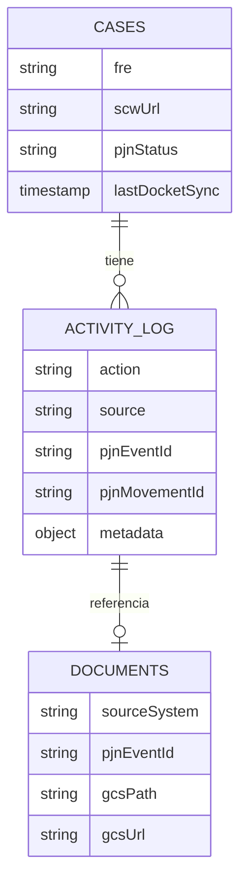
```mermaid
erDiagram
    CASES ||--o{ ACTIVITY_LOG : tiene
    ACTIVITY_LOG {
        string action
        string source
        string pjnEventId
        string pjnMovementId
        object metadata
    }
    CASES {
        string fre
        string scwUrl
        string pjnStatus
        timestamp lastDocketSync
    }
    
    ACTIVITY_LOG ||--o| DOCUMENTS : referencia
    DOCUMENTS {
        string sourceSystem
        string pjnEventId
        string gcsPath
        string gcsUrl
    }
```

---

## 4. Clasificación Inteligente de Documentos y Extracción de Metadatos

**Descripción**: Clasificar automáticamente los PDFs descargados del PJN (resoluciones, notificaciones, providencias) y extraer metadatos clave (juez, fecha, tipo) usando OCR + LLM a través del microservicio `document-processor`.

**Valor para el Usuario**:
- **Búsqueda instantánea**: Encontrar "todas las resoluciones del Juez X en 2024"
- **Etiquetado automático**: Documentos auto-etiquetados por tipo (sentencia, providencia, notificación)
- **Extracción de datos clave**: Plazos, montos y partes extraídos de PDFs

**Flujo Técnico**:

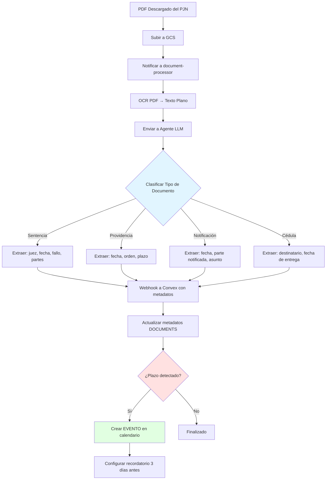
```mermaid
flowchart TD
    A[PDF Descargado del PJN] --> B[Subir a GCS]
    B --> C[Notificar a document-processor]
    C --> D[OCR PDF → Texto Plano]
    D --> E[Enviar a Agente LLM]
    E --> F{Clasificar Tipo de Documento}
    F -->|Sentencia| G[Extraer: juez, fecha, fallo, partes]
    F -->|Providencia| H[Extraer: fecha, orden, plazo]
    F -->|Notificación| I[Extraer: fecha, parte notificada, asunto]
    F -->|Cédula| J[Extraer: destinatario, fecha de entrega]
    G --> K[Webhook a Convex con metadatos]
    H --> K
    I --> K
    J --> K
    K --> L[Actualizar metadatos DOCUMENTS]
    L --> M{¿Plazo detectado?}
    M -->|Sí| N[Crear EVENTO en calendario]
    M -->|No| O[Finalizado]
    N --> P[Configurar recordatorio 3 días antes]
    
    style F fill:#e1f5ff
    style M fill:#ffe1e1
    style N fill:#e1ffe1
```

**Arquitectura del Microservicio**:
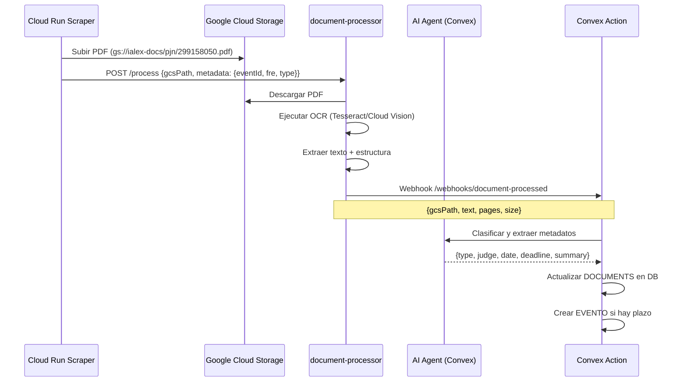
```mermaid
sequenceDiagram
    participant CloudRun as Cloud Run Scraper
    participant GCS as Google Cloud Storage
    participant DocProc as document-processor
    participant LLM as AI Agent (Convex)
    participant Convex as Convex Action

    CloudRun->>GCS: Subir PDF (gs://ialex-docs/pjn/299158050.pdf)
    CloudRun->>DocProc: POST /process {gcsPath, metadata: {eventId, fre, type}}
    DocProc->>GCS: Descargar PDF
    DocProc->>DocProc: Ejecutar OCR (Tesseract/Cloud Vision)
    DocProc->>DocProc: Extraer texto + estructura
    DocProc->>Convex: Webhook /webhooks/document-processed
    Note over DocProc,Convex: {gcsPath, text, pages, size}
    Convex->>LLM: Clasificar y extraer metadatos
    LLM-->>Convex: {type, judge, date, deadline, summary}
    Convex->>Convex: Actualizar DOCUMENTS en DB
    Convex->>Convex: Crear EVENTO si hay plazo
```

**Prompt LLM para Clasificación**:
```
Sistema: Eres un clasificador de documentos legales para tribunales federales argentinos.

Usuario: Clasifica este documento y extrae datos estructurados:
---
{TEXTO_OCR}
---

Salida JSON:
{
  "tipo": "sentencia" | "providencia" | "notificación" | "cédula" | "otro",
  "tribunal": "...",
  "juez": "...",
  "fecha": "YYYY-MM-DD",
  "partes": ["...", "..."],
  "plazo": "YYYY-MM-DD" | null,
  "resumen": "..."
}
```

---

## 5. Alertas Proactivas de Plazos y Audiencias

**Descripción**: Extraer plazos y fechas de audiencias de documentos PJN y expediente SCW, crear eventos de calendario en iAlex y enviar recordatorios multicanal.

**Valor para el Usuario**:
- **Nunca perder un plazo**: Extracción automática de documentos del tribunal
- **Alertas multicanal**: Email, WhatsApp, notificaciones in-app
- **Coordinación de equipo**: Calendario compartido para casos asignados al equipo

**Flujo Técnico**:

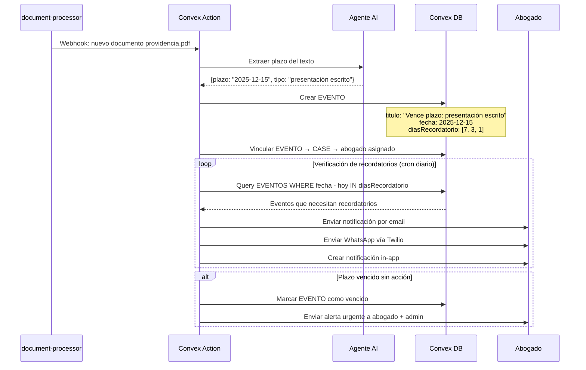
```mermaid
sequenceDiagram
    participant DocProc as document-processor
    participant Convex as Convex Action
    participant LLM as Agente AI
    participant DB as Convex DB
    participant User as Abogado

    DocProc->>Convex: Webhook: nuevo documento providencia.pdf
    Convex->>LLM: Extraer plazo del texto
    LLM-->>Convex: {plazo: "2025-12-15", tipo: "presentación escrito"}
    Convex->>DB: Crear EVENTO
    Note over DB: titulo: "Vence plazo: presentación escrito"<br/>fecha: 2025-12-15<br/>diasRecordatorio: [7, 3, 1]
    Convex->>DB: Vincular EVENTO → CASE → abogado asignado
    
    loop Verificación de recordatorios (cron diario)
        Convex->>DB: Query EVENTOS WHERE fecha - hoy IN diasRecordatorio
        DB-->>Convex: Eventos que necesitan recordatorios
        Convex->>User: Enviar notificación por email
        Convex->>User: Enviar WhatsApp vía Twilio
        Convex->>User: Crear notificación in-app
    end
    
    alt Plazo vencido sin acción
        Convex->>DB: Marcar EVENTO como vencido
        Convex->>User: Enviar alerta urgente a abogado + admin
    end
```

**Patrones de Detección de Plazos**:
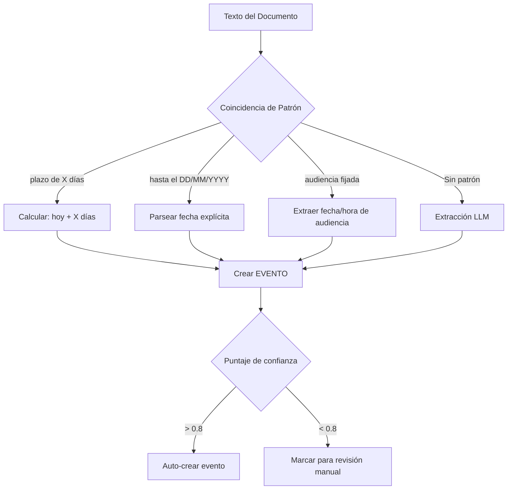
```mermaid
graph TD
    A[Texto del Documento] --> B{Coincidencia de Patrón}
    B -->|"plazo de X días"| C[Calcular: hoy + X días]
    B -->|"hasta el DD/MM/YYYY"| D[Parsear fecha explícita]
    B -->|"audiencia fijada"| E[Extraer fecha/hora de audiencia]
    B -->|Sin patrón| F[Extracción LLM]
    C --> G[Crear EVENTO]
    D --> G
    E --> G
    F --> G
    G --> H{Puntaje de confianza}
    H -->|> 0.8| I[Auto-crear evento]
    H -->|< 0.8| J[Marcar para revisión manual]
```

---

## 6. Integración Bidireccional de Presentación de Escritos

**Descripción**: Permitir a los abogados redactar escritos en iAlex y presentarlos directamente al "Sistema de Escritos Web" del PJN, luego rastrear su estado y vincularlos al caso.

**Valor para el Usuario**:
- **Flujo de trabajo fluido**: Redactar en iAlex → presentar al PJN → rastrear estado, todo en un solo lugar
- **Control de versiones**: Mantener borradores internos + versión final presentada vinculadas
- **Seguimiento de estado**: Saber cuándo el PJN aceptó/rechazó la presentación

**Flujo Técnico**:

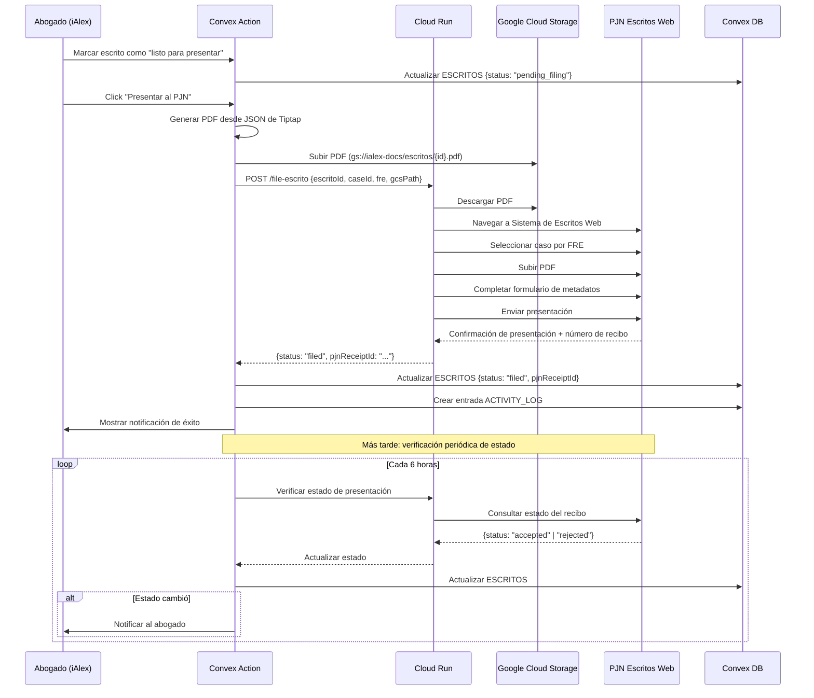
```mermaid
sequenceDiagram
    participant User as Abogado (iAlex)
    participant Convex as Convex Action
    participant CloudRun as Cloud Run
    participant GCS as Google Cloud Storage
    participant PJN as PJN Escritos Web
    participant DB as Convex DB

    User->>Convex: Marcar escrito como "listo para presentar"
    Convex->>DB: Actualizar ESCRITOS {status: "pending_filing"}
    User->>Convex: Click "Presentar al PJN"
    Convex->>Convex: Generar PDF desde JSON de Tiptap
    Convex->>GCS: Subir PDF (gs://ialex-docs/escritos/{id}.pdf)
    Convex->>CloudRun: POST /file-escrito {escritoId, caseId, fre, gcsPath}
    CloudRun->>GCS: Descargar PDF
    CloudRun->>PJN: Navegar a Sistema de Escritos Web
    CloudRun->>PJN: Seleccionar caso por FRE
    CloudRun->>PJN: Subir PDF
    CloudRun->>PJN: Completar formulario de metadatos
    CloudRun->>PJN: Enviar presentación
    PJN-->>CloudRun: Confirmación de presentación + número de recibo
    CloudRun-->>Convex: {status: "filed", pjnReceiptId: "..."}
    Convex->>DB: Actualizar ESCRITOS {status: "filed", pjnReceiptId}
    Convex->>DB: Crear entrada ACTIVITY_LOG
    Convex->>User: Mostrar notificación de éxito
    
    Note over Convex,PJN: Más tarde: verificación periódica de estado
    loop Cada 6 horas
        Convex->>CloudRun: Verificar estado de presentación
        CloudRun->>PJN: Consultar estado del recibo
        PJN-->>CloudRun: {status: "accepted" | "rejected"}
        CloudRun-->>Convex: Actualizar estado
        Convex->>DB: Actualizar ESCRITOS
        alt Estado cambió
            Convex->>User: Notificar al abogado
        end
    end
```

**Máquina de Estados de Presentación**:
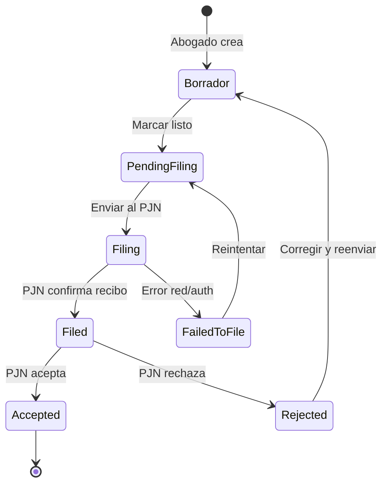
```mermaid
stateDiagram-v2
    [*] --> Borrador: Abogado crea
    Borrador --> PendingFiling: Marcar listo
    PendingFiling --> Filing: Enviar al PJN
    Filing --> Filed: PJN confirma recibo
    Filing --> FailedToFile: Error red/auth
    FailedToFile --> PendingFiling: Reintentar
    Filed --> Accepted: PJN acepta
    Filed --> Rejected: PJN rechaza
    Rejected --> Borrador: Corregir y reenviar
    Accepted --> [*]
```

---

## 7. Agregación Multi-Cuenta y de Casos de Equipo

**Descripción**: Para estudios jurídicos con múltiples abogados, agregar casos y notificaciones a través de todas las cuentas PJN, con control de acceso basado en equipos y distribución de carga de trabajo.

**Valor para el Usuario**:
- **Visibilidad a nivel de estudio**: Los administradores ven todos los casos a través de las cuentas PJN de todos los abogados
- **Balance de carga de trabajo**: Ver qué abogados tienen plazos próximos
- **Responsabilidad compartida**: Los miembros del equipo pueden cubrirse entre sí

**Flujo Técnico**:

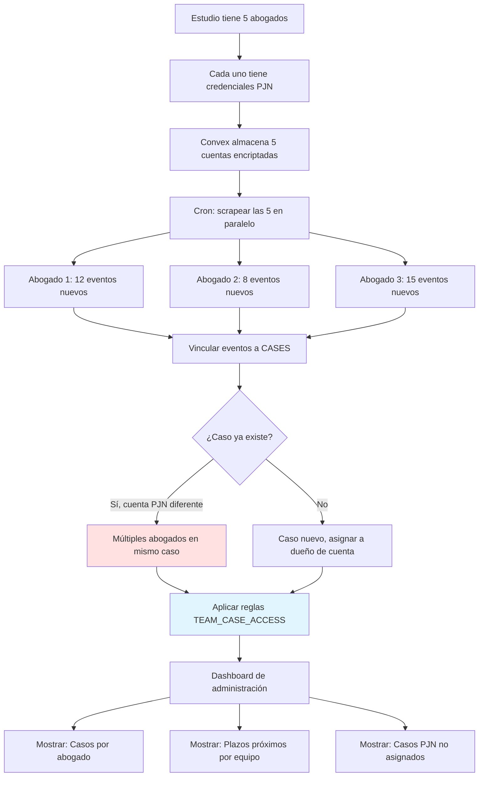
```mermaid
flowchart TD
    A[Estudio tiene 5 abogados] --> B[Cada uno tiene credenciales PJN]
    B --> C[Convex almacena 5 cuentas encriptadas]
    C --> D[Cron: scrapear las 5 en paralelo]
    D --> E[Abogado 1: 12 eventos nuevos]
    D --> F[Abogado 2: 8 eventos nuevos]
    D --> G[Abogado 3: 15 eventos nuevos]
    E --> H[Vincular eventos a CASES]
    F --> H
    G --> H
    H --> I{¿Caso ya existe?}
    I -->|Sí, cuenta PJN diferente| J[Múltiples abogados en mismo caso]
    I -->|No| K[Caso nuevo, asignar a dueño de cuenta]
    J --> L[Aplicar reglas TEAM_CASE_ACCESS]
    K --> L
    L --> M[Dashboard de administración]
    M --> N[Mostrar: Casos por abogado]
    M --> O[Mostrar: Plazos próximos por equipo]
    M --> P[Mostrar: Casos PJN no asignados]
    
    style J fill:#ffe1e1
    style L fill:#e1f5ff
```

**Vistas del Dashboard**:
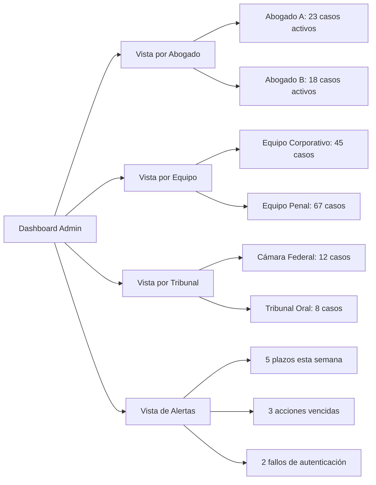
```mermaid
graph LR
    A[Dashboard Admin] --> B[Vista por Abogado]
    A --> C[Vista por Equipo]
    A --> D[Vista por Tribunal]
    A --> E[Vista de Alertas]
    
    B --> B1[Abogado A: 23 casos activos]
    B --> B2[Abogado B: 18 casos activos]
    
    C --> C1[Equipo Corporativo: 45 casos]
    C --> C2[Equipo Penal: 67 casos]
    
    D --> D1[Cámara Federal: 12 casos]
    D --> D2[Tribunal Oral: 8 casos]
    
    E --> E1[5 plazos esta semana]
    E --> E2[3 acciones vencidas]
    E --> E3[2 fallos de autenticación]
```

---

## 8. Predicción Inteligente de Estado de Casos y Alertas de Riesgo

**Descripción**: Usar datos históricos del expediente y análisis LLM para predecir resultados de casos, señalar riesgos procesales y sugerir próximas acciones.

**Valor para el Usuario**:
- **Estrategia proactiva**: Saber cuándo un caso se está estancando o está en riesgo
- **Reconocimiento de patrones**: "Casos como este típicamente se resuelven en 6-8 meses"
- **Sugerencias de acción**: "No has respondido a la última providencia—plazo en 3 días"

**Flujo Técnico**:

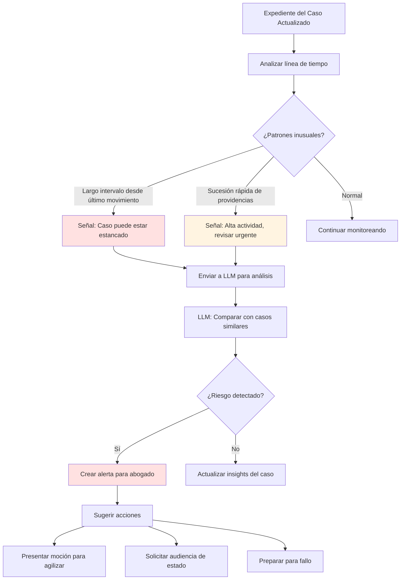
```mermaid
flowchart TD
    A[Expediente del Caso Actualizado] --> B[Analizar línea de tiempo]
    B --> C{¿Patrones inusuales?}
    C -->|Largo intervalo desde último movimiento| D[Señal: Caso puede estar estancado]
    C -->|Sucesión rápida de providencias| E[Señal: Alta actividad, revisar urgente]
    C -->|Normal| F[Continuar monitoreando]
    D --> G[Enviar a LLM para análisis]
    E --> G
    G --> H[LLM: Comparar con casos similares]
    H --> I{¿Riesgo detectado?}
    I -->|Sí| J[Crear alerta para abogado]
    I -->|No| K[Actualizar insights del caso]
    J --> L[Sugerir acciones]
    L --> M["Presentar moción para agilizar"]
    L --> N["Solicitar audiencia de estado"]
    L --> O["Preparar para fallo"]
    
    style D fill:#ffe1e1
    style E fill:#fff4e1
    style J fill:#ffe1e1
```

**Prompt de Análisis LLM**:
```
Sistema: Eres un analista de casos legales para tribunales federales argentinos.

Usuario: Analiza esta línea de tiempo del caso e identifica riesgos:

Caso: FRE 7262/2025/CFC1 (Habeas Corpus)
Presentado: 2025-03-15
Último movimiento: 2025-11-20 (Providencia - plazo 10 días)
Hoy: 2025-12-01

Expediente:
- 2025-03-15: Presentación inicial
- 2025-04-02: Providencia - vista al fiscal
- 2025-06-10: Dictamen fiscal
- 2025-11-20: Providencia - plazo 10 días para responder

Identifica:
1. Riesgos procesales
2. Plazos perdidos
3. Próximas acciones recomendadas
4. Línea de tiempo estimada de resolución
```

---

## 9. Gestión Segura de Credenciales y Monitoreo de Salud de Sesión

**Descripción**: UI amigable para gestionar credenciales PJN con verificaciones de salud, estado de sesión y re-autenticación automática con consentimiento del usuario.

**Valor para el Usuario**:
- **Transparencia**: Ver cuándo tuvo éxito la última sincronización, expiración de sesión, estado de autenticación
- **Control**: Revocar/actualizar credenciales en cualquier momento
- **Confiabilidad**: Recuperación automática de expiración de sesión sin intervención manual

**Flujo Técnico**:

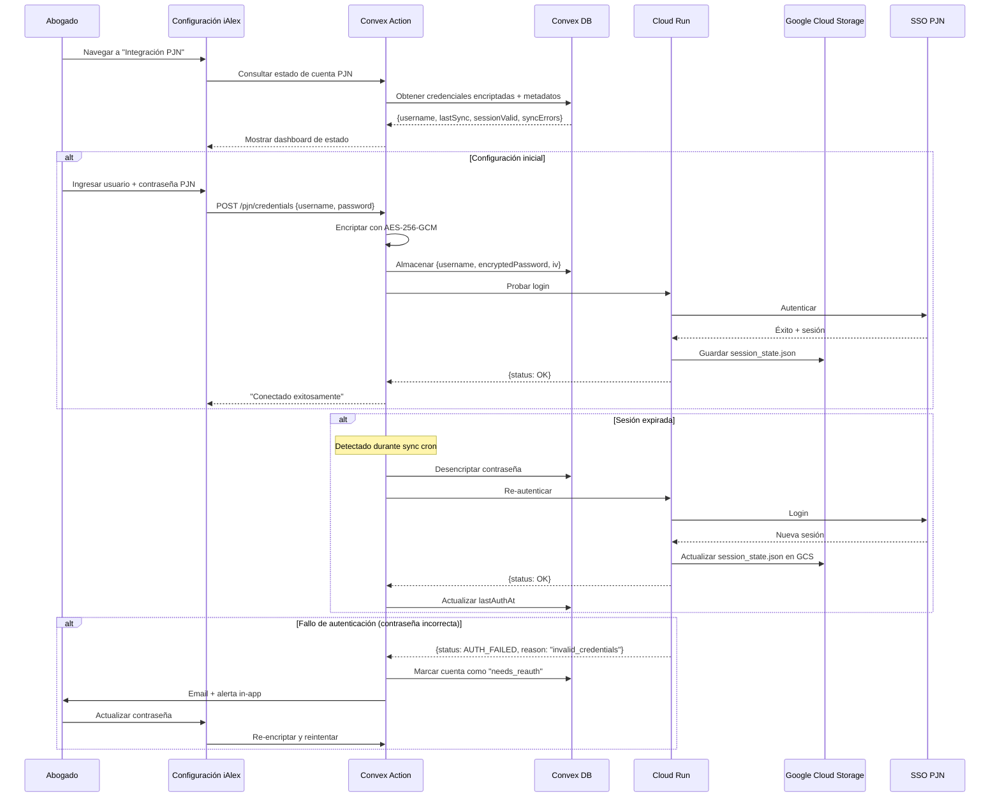
```mermaid
sequenceDiagram
    participant User as Abogado
    participant UI as Configuración iAlex
    participant Convex as Convex Action
    participant DB as Convex DB
    participant CloudRun as Cloud Run
    participant GCS as Google Cloud Storage
    participant PJN as SSO PJN

    User->>UI: Navegar a "Integración PJN"
    UI->>Convex: Consultar estado de cuenta PJN
    Convex->>DB: Obtener credenciales encriptadas + metadatos
    DB-->>Convex: {username, lastSync, sessionValid, syncErrors}
    Convex-->>UI: Mostrar dashboard de estado
    
    alt Configuración inicial
        User->>UI: Ingresar usuario + contraseña PJN
        UI->>Convex: POST /pjn/credentials {username, password}
        Convex->>Convex: Encriptar con AES-256-GCM
        Convex->>DB: Almacenar {username, encryptedPassword, iv}
        Convex->>CloudRun: Probar login
        CloudRun->>PJN: Autenticar
        PJN-->>CloudRun: Éxito + sesión
        CloudRun->>GCS: Guardar session_state.json
        CloudRun-->>Convex: {status: OK}
        Convex-->>UI: "Conectado exitosamente"
    end
    
    alt Sesión expirada
        Note over Convex: Detectado durante sync cron
        Convex->>DB: Desencriptar contraseña
        Convex->>CloudRun: Re-autenticar
        CloudRun->>PJN: Login
        PJN-->>CloudRun: Nueva sesión
        CloudRun->>GCS: Actualizar session_state.json en GCS
        CloudRun-->>Convex: {status: OK}
        Convex->>DB: Actualizar lastAuthAt
    end
    
    alt Fallo de autenticación (contraseña incorrecta)
        CloudRun-->>Convex: {status: AUTH_FAILED, reason: "invalid_credentials"}
        Convex->>DB: Marcar cuenta como "needs_reauth"
        Convex->>User: Email + alerta in-app
        User->>UI: Actualizar contraseña
        UI->>Convex: Re-encriptar y reintentar
    end
```

**Componentes de UI de Configuración**:
```mermaid
graph TD
    A[Configuración Integración PJN] --> B[Estado de Conexión]
    A --> C[Historial de Sincronización]
    A --> D[Gestión de Credenciales]
    A --> E[Privacidad y Seguridad]
    
    B --> B1[✅ Conectado - Sesión válida hasta 2025-12-05]
    B --> B2[Última sincronización: hace 2 minutos]
    B --> B3[Próxima sincronización: en 13 minutos]
    
    C --> C1[Tabla: Fecha | Eventos | Documentos | Estado]
    C --> C2[2025-12-01 14:30 | 3 eventos | 3 PDFs | Éxito]
    
    D --> D1[Botón Actualizar Contraseña]
    D --> D2[Botón Desconectar Cuenta]
    D --> D3[Botón Probar Conexión]
    
    E --> E1["🔒 Contraseña encriptada en reposo"]
    E --> E2["🔐 Sesión almacenada en GCS aislado"]
    E --> E3["⏱️ Auto-logout después de 30 días inactivo"]
```

---

## 10. Pista de Auditoría e Informes de Cumplimiento

**Descripción**: Registro de auditoría completo de todas las interacciones PJN (logins, scrapes, descargas) con informes de cumplimiento para Acordada 31/2011 y regulaciones de protección de datos.

**Valor para el Usuario**:
- **Cumplimiento regulatorio**: Demostrar uso adecuado de credenciales PJN
- **Capacidad forense**: Rastrear exactamente cuándo/qué se accedió
- **Transparencia con clientes**: Mostrar a clientes cuándo se verificó su caso

**Flujo Técnico**:

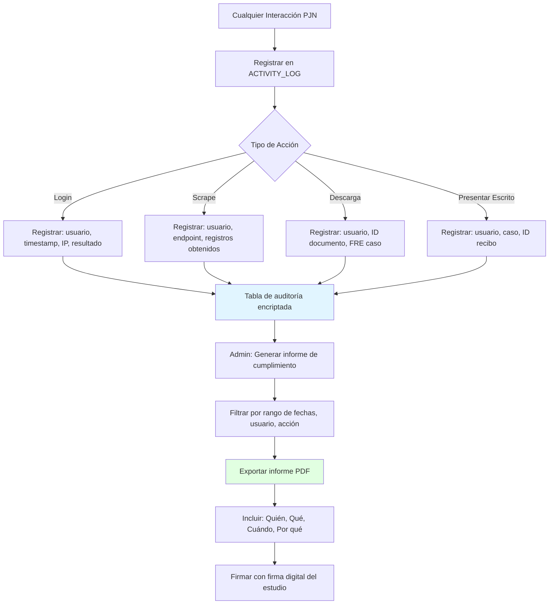
```mermaid
flowchart TD
    A[Cualquier Interacción PJN] --> B[Registrar en ACTIVITY_LOG]
    B --> C{Tipo de Acción}
    C -->|Login| D[Registrar: usuario, timestamp, IP, resultado]
    C -->|Scrape| E[Registrar: usuario, endpoint, registros obtenidos]
    C -->|Descarga| F[Registrar: usuario, ID documento, FRE caso]
    C -->|Presentar Escrito| G[Registrar: usuario, caso, ID recibo]
    D --> H[Tabla de auditoría encriptada]
    E --> H
    F --> H
    G --> H
    H --> I[Admin: Generar informe de cumplimiento]
    I --> J[Filtrar por rango de fechas, usuario, acción]
    J --> K[Exportar informe PDF]
    K --> L[Incluir: Quién, Qué, Cuándo, Por qué]
    L --> M[Firmar con firma digital del estudio]
    
    style H fill:#e1f5ff
    style K fill:#e1ffe1
```

**Estructura del Informe de Cumplimiento**:
```
INFORME DE USO DE CREDENCIALES PJN
Período: 01/11/2025 - 30/11/2025
Usuario: Dr. Daniel Fischer (CUIT: 20-26418320-1)

RESUMEN:
- Total de accesos: 124
- Documentos descargados: 47
- Escritos presentados: 3
- Casos consultados: 23

DETALLE DE ACCESOS:
| Fecha/Hora          | Acción              | Caso/Expediente      | Resultado |
|---------------------|---------------------|----------------------|-----------|
| 2025-11-01 09:15:32 | Login automático    | -                    | Exitoso   |
| 2025-11-01 09:15:45 | Consulta eventos    | -                    | 12 nuevos |
| 2025-11-01 09:16:02 | Descarga documento  | FRE 7262/2025/CFC1   | Exitoso   |
| ...                 | ...                 | ...                  | ...       |

CUMPLIMIENTO ACORDADA 31/2011:
✅ Credenciales almacenadas de forma segura (AES-256-GCM)
✅ Uso exclusivo por titular de la cuenta
✅ Accesos registrados y auditables
✅ Sin compartición de sesiones entre usuarios

INFRAESTRUCTURA DE ALMACENAMIENTO:
✅ Documentos almacenados en Google Cloud Storage
✅ Sesiones aisladas por usuario en GCS
✅ Procesamiento de documentos mediante microservicio dedicado
✅ Sin almacenamiento local de credenciales o archivos
```

---

## Resumen: Matriz de Prioridad de Funcionalidades

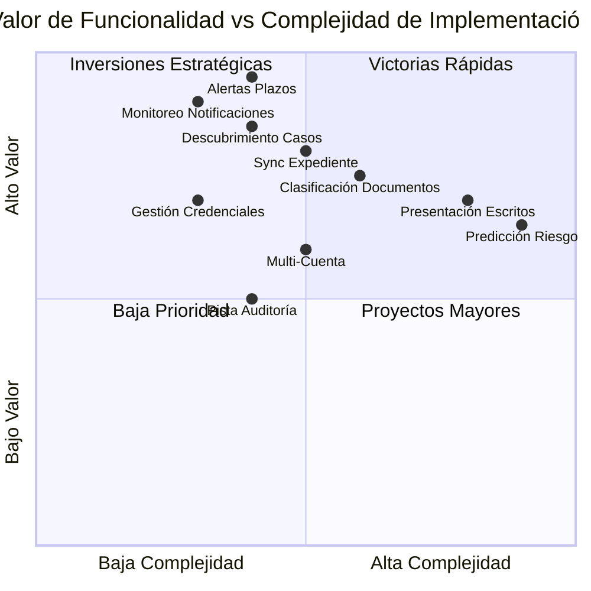
```mermaid
quadrantChart
    title Valor de Funcionalidad vs Complejidad de Implementación
    x-axis Baja Complejidad --> Alta Complejidad
    y-axis Bajo Valor --> Alto Valor
    quadrant-1 Victorias Rápidas
    quadrant-2 Inversiones Estratégicas
    quadrant-3 Baja Prioridad
    quadrant-4 Proyectos Mayores
    
    Monitoreo Notificaciones: [0.3, 0.9]
    Descubrimiento Casos: [0.4, 0.85]
    Sync Expediente: [0.5, 0.8]
    Clasificación Documentos: [0.6, 0.75]
    Alertas Plazos: [0.4, 0.95]
    Presentación Escritos: [0.8, 0.7]
    Multi-Cuenta: [0.5, 0.6]
    Predicción Riesgo: [0.9, 0.65]
    Gestión Credenciales: [0.3, 0.7]
    Pista Auditoría: [0.4, 0.5]
```

## Arquitectura de Almacenamiento y Procesamiento

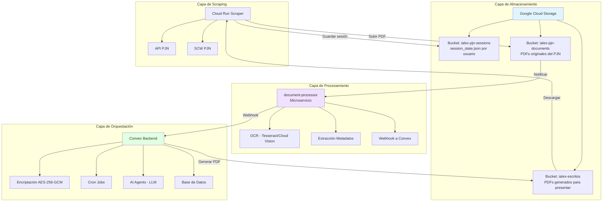
```mermaid
graph TB
    subgraph "Capa de Scraping"
        A[Cloud Run Scraper] --> B[API PJN]
        A --> C[SCW PJN]
    end
    
    subgraph "Capa de Almacenamiento"
        D[Google Cloud Storage]
        D --> D1[Bucket: ialex-pjn-sessions<br/>session_state.json por usuario]
        D --> D2[Bucket: ialex-pjn-documents<br/>PDFs originales del PJN]
        D --> D3[Bucket: ialex-escritos<br/>PDFs generados para presentar]
    end
    
    subgraph "Capa de Procesamiento"
        E[document-processor<br/>Microservicio]
        E --> E1[OCR - Tesseract/Cloud Vision]
        E --> E2[Extracción Metadatos]
        E --> E3[Webhook a Convex]
    end
    
    subgraph "Capa de Orquestación"
        F[Convex Backend]
        F --> F1[Encriptación AES-256-GCM]
        F --> F2[Cron Jobs]
        F --> F3[AI Agents - LLM]
        F --> F4[Base de Datos]
    end
    
    A -->|Subir PDF| D2
    A -->|Guardar sesión| D1
    D2 -->|Notificar| E
    E -->|Webhook| F
    F -->|Generar PDF| D3
    D3 -->|Descargar| A
    
    style D fill:#e1f5ff
    style E fill:#f0e1ff
    style F fill:#e1ffe1
```

**Fases de Implementación Recomendadas**:

**Fase 1 (MVP - 4-6 semanas)**:
1. Monitoreo de Notificaciones (#1)
2. Gestión de Credenciales (#9)
3. Descubrimiento de Casos (#2)

**Fase 2 (Funcionalidades Core - 6-8 semanas)**:
4. Sincronización de Expediente (#3)
5. Alertas de Plazos (#5)
6. Clasificación de Documentos (#4)

**Fase 3 (Avanzadas - 8-10 semanas)**:
7. Agregación Multi-Cuenta (#7)
8. Pista de Auditoría (#10)
9. Presentación de Escritos (#6)

**Fase 4 (Potenciadas por IA - 10-12 semanas)**:
10. Predicción de Riesgo e Insights (#8)

Cada funcionalidad se construye sobre la base segura que ya has diseñado (Convex + Cloud Run + GCS + AES-256-GCM + microservicio document-processor), asegurando el cumplimiento con la Acordada 31/2011 mientras se entrega valor masivo a los abogados que usan iAlex.